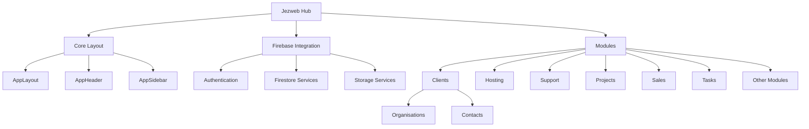

# Jezweb Hub

Jezweb Hub is a comprehensive dashboard application for managing clients, websites, projects, and support tickets. Built with React and Firebase, it provides a centralised platform for Jezweb's business operations.

## Features

- **Client Management**: Manage organisations and contacts with detailed profiles
- **Website Management**: Track and manage client websites and hosting
- **Project Management**: Oversee various project types including website, graphics, app, SEO, and content projects
- **Support System**: Handle support tickets and client requests
- **Task Management**: Organise and track tasks with Kanban board view
- **Sales Tools**: Manage leads and generate quotes
- **Dynamic Form Fields**: Form fields like dropdown values are stored in Firebase for easy updates
- **Autocomplete Fields**: Smart input fields that allow selecting from existing values or adding new ones

## Technology Stack

- **Frontend**: React 18, TypeScript, Tailwind CSS 4
- **State Management**: React Hooks and Context API
- **Backend**: Firebase (Authentication, Firestore, Storage)
- **Routing**: React Router 7
- **UI Components**: Custom components built on TailAdmin Pro template
- **Charts & Visualisations**: ApexCharts
- **Forms**: Custom form components with validation
- **Calendar**: FullCalendar integration

## Installation & Setup

### Prerequisites

- Node.js 18.x or later (recommended to use Node.js 20.x or later)
- Firebase account with a configured project

### Getting Started

1. Clone the repository:

   ```bash
   git clone https://github.com/your-username/jezweb-hub.git
   cd jezweb-hub
   ```

2. Install dependencies:

   ```bash
   npm install --legacy-peer-deps
   # or
   yarn install
   ```

   > Some included packages cause peer-deps issues with React 18 while installing.
   >
   > With npm the `--legacy-peer-deps` flag is a workaround for that at the moment.

3. Configure Firebase:

   - Create a `.env` file in the root directory
   - Add your Firebase configuration (see `.env.example` for reference)

4. Start the development server:

   ```bash
   npm run dev
   # or
   yarn dev
   ```

   This runs the app in development mode.\
   Open [http://localhost:5173](http://localhost:5173) to view it in the browser.

5. Build for production:

   ```bash
   npm run build
   # or
   yarn build
   ```

## Project Structure



### Directory Structure

- `/src`: Source code
  - `/components`: Reusable UI components
  - `/context`: React context providers
  - `/firebase`: Firebase configuration and services
  - `/hooks`: Custom React hooks
  - `/layout`: Layout components
  - `/pages`: Page components
  - `/services`: Service modules for data operations
  - `/types`: TypeScript type definitions
  - `/utils`: Utility functions

## Usage

### Authentication

The application requires authentication to access. Use the login page to sign in with your credentials.

### Navigation

The sidebar provides access to all main modules:

- Dashboard: Overview and quick access
- Clients: Manage organisations and contacts
- Hosting: Manage websites
- Support: Handle support tickets
- Projects: Manage various project types
- Sales: Track leads and quotes
- Tasks: Manage and organise tasks
- Settings: Configure application settings

### Form Fields Management

Dynamic form fields (like dropdown values) can be managed from the Settings page. This allows administrators to add, edit, or remove options for various form fields throughout the application.

## Contributing

Contributions are welcome! Please follow these steps:

1. Fork the repository
2. Create a feature branch (`git checkout -b feature/amazing-feature`)
3. Commit your changes (`git commit -m 'Add some amazing feature'`)
4. Push to the branch (`git push origin feature/amazing-feature`)
5. Open a Pull Request

Please ensure your code follows the project's coding standards and includes appropriate tests.

## License

This project is proprietary software owned by Jezweb. All rights reserved.
