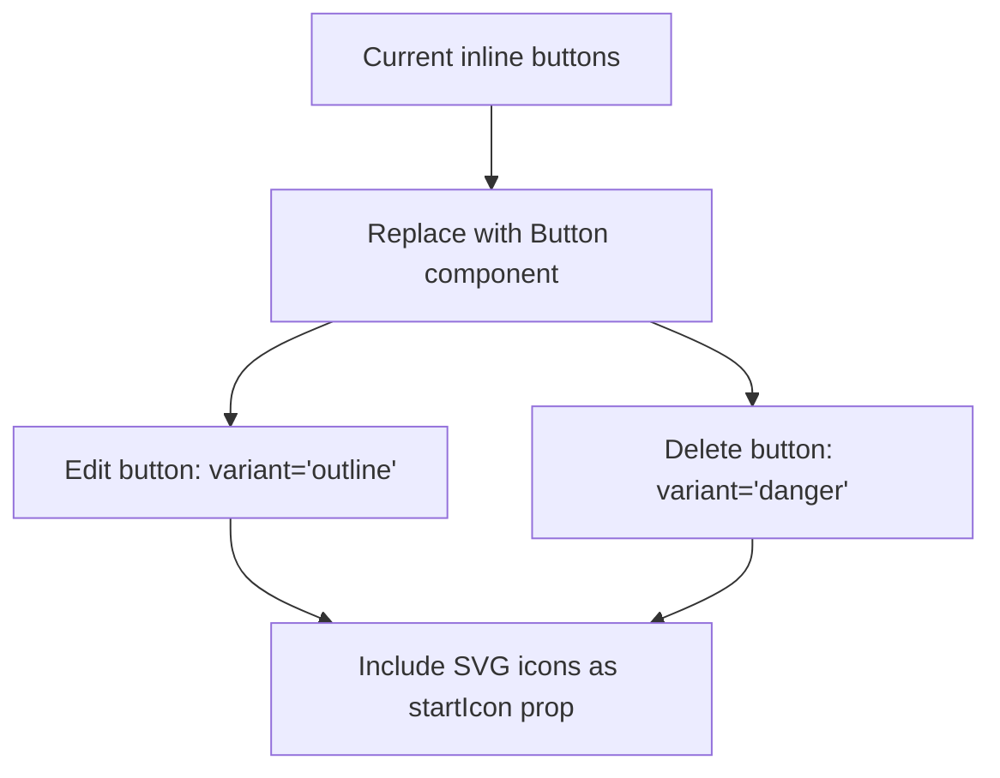
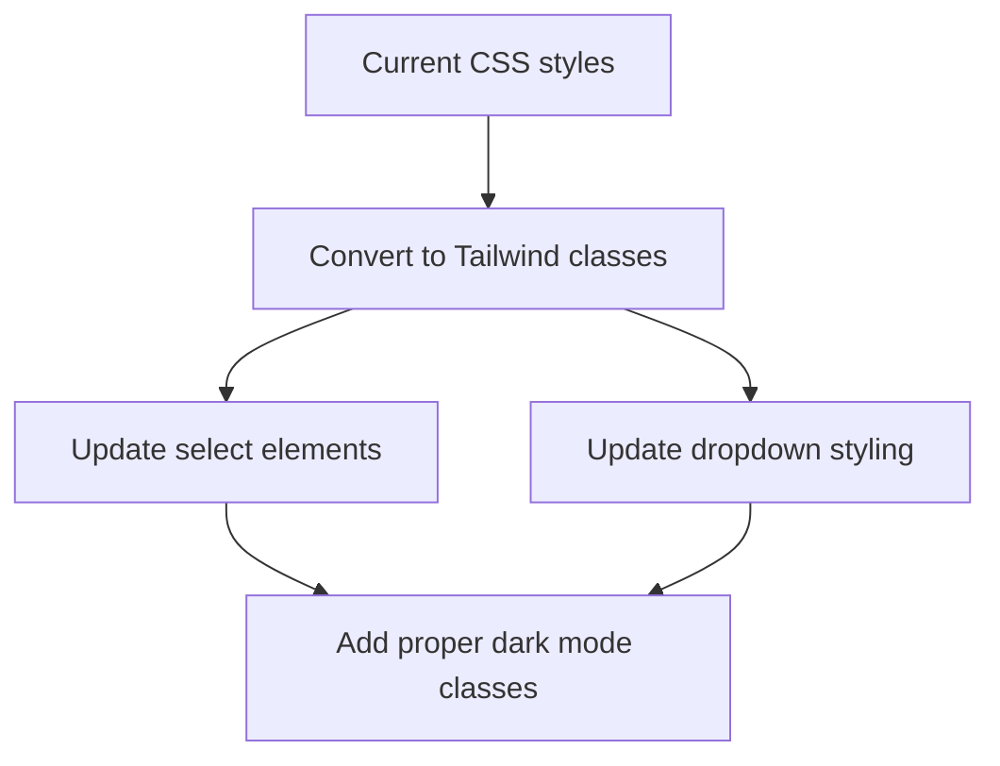

# Dark Mode Styling Improvements Plan

This document outlines the plan for improving dark mode styling in the contacts pages of the Jezweb Hub application.

## 1. Component Updates

### 1.1 ContactDetail.tsx Button Updates

Replace the custom inline buttons with the Button component from the UI library:



**Implementation Details:**
- Import the Button component: `import Button from "../../../components/ui/button/Button";`
- Replace the edit button with:
  ```jsx
  <Button
    variant="outline"
    onClick={handleEdit}
    startIcon={<svg>...</svg>}
  >
    Edit
  </Button>
  ```
- Replace the delete button with:
  ```jsx
  <Button
    variant="danger"
    onClick={handleDelete}
    startIcon={<svg>...</svg>}
  >
    Delete
  </Button>
  ```

### 1.2 CountryStateCityField Component Updates

Convert the custom CSS styles to Tailwind classes for better dark mode support:



**Implementation Details:**
- Remove the custom CSS styles block (lines 79-116)
- Update the CountrySelect, StateSelect, and CitySelect components with Tailwind classes
- Apply proper dark mode styling to all elements

### 1.3 OrganisationAssociationForm Dark Mode Updates

Replace all instances of old dark mode classes with the new pattern:

```mermaid
graph TD
    A[Identify old dark mode classes] --> B[Replace with new pattern]
    B --> C[dark:bg-boxdark → dark:bg-white/[0.03]]
    B --> D[dark:border-strokedark → dark:border-gray-800]
    C --> E[Update all instances]
    D --> E
```

**Implementation Details:**
- Replace `dark:bg-boxdark` with `dark:bg-white/[0.03]` throughout the file
- Replace `dark:border-strokedark` with `dark:border-gray-800` throughout the file
- Ensure consistent border radius with `rounded-2xl` where appropriate

## 2. UI Style Guide Updates

Update the docs/ui-style-guide.md file to document the dark mode styling patterns:

**Implementation Details:**
- Update the "Dark Mode Support" section with comprehensive guidelines
- Document the new patterns:
  - Backgrounds: `dark:bg-white/[0.03]` instead of `dark:bg-boxdark`
  - Borders: `dark:border-gray-800` instead of `dark:border-strokedark`
  - Border radius: `rounded-2xl` for consistency
- Add component-specific examples for buttons, cards, forms, and dropdowns
- Include best practices for dark mode implementation

## 3. Implementation Approach

The implementation will follow this sequence:

1. Update the UI Style Guide first to establish the patterns
2. Update the OrganisationAssociationForm component
3. Update the CountryStateCityField component
4. Update the ContactDetail.tsx buttons
5. Test all changes in both light and dark modes

## 4. Testing Strategy

To ensure the changes work correctly:

- Test each component in both light and dark modes
- Verify that all interactive elements (buttons, dropdowns) work correctly
- Check for any contrast issues or readability problems
- Ensure consistent appearance across different screen sizes