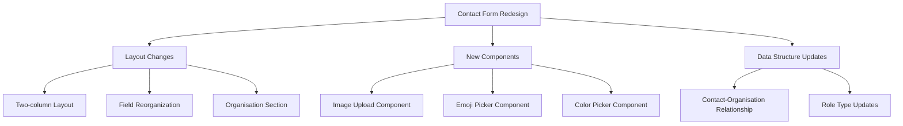
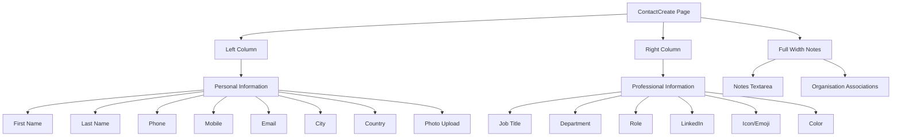
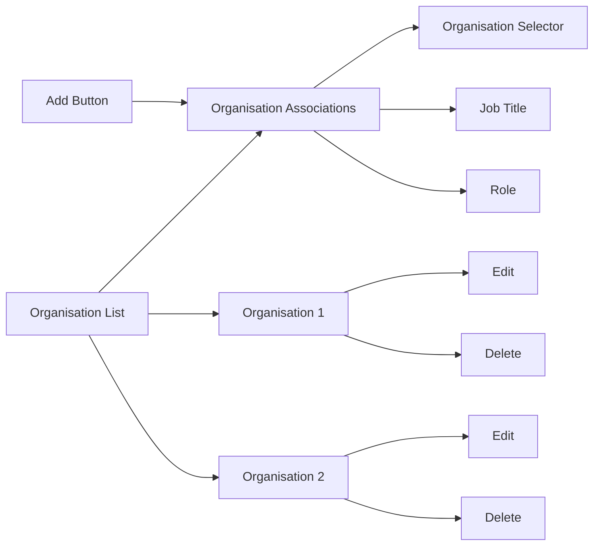
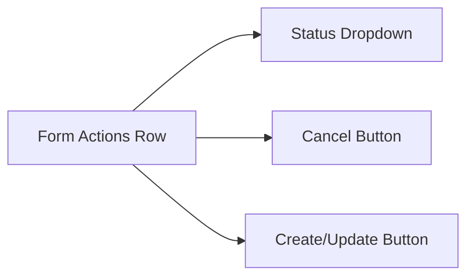

# Contact Form Redesign Plan

## Overview of Changes



## 1. Layout Changes

### 1.1 Two-Column Layout

We'll restructure the ContactCreate.tsx page to match the two-column layout of OrganisationCreate.tsx:



### 1.2 Organisation Associations Section

We'll create a new section above the notes for managing organisation associations:



### 1.3 Status Field Placement

Move the status field to the bottom left, in the same row as the action buttons:



## 2. New Components

### 2.1 Image Upload Component

Create a new component for handling image uploads:

```typescript
// ImageUpload.tsx
interface ImageUploadProps {
  initialImage?: string;
  onChange: (imageUrl: string) => void;
}
```

### 2.2 Emoji Picker Component

Implement an emoji picker for the icon field:

```typescript
// EmojiPicker.tsx
interface EmojiPickerProps {
  initialEmoji?: string;
  onChange: (emoji: string) => void;
}
```

### 2.3 Color Picker Component

Create a color picker component with preset colors and hex input:

```typescript
// ColorPicker.tsx
interface ColorPickerProps {
  initialColor?: string;
  onChange: (color: string) => void;
}
```

### 2.4 Organisation Association Component

Create a component for managing organisation associations:

```typescript
// OrganisationAssociationManager.tsx
interface OrganisationAssociationManagerProps {
  contactId?: string;
  initialAssociations?: Array<{
    organisationId: string;
    organisationName: string;
    jobTitle?: string;
    role?: string;
  }>;
  onChange: (associations: Array<{
    organisationId: string;
    jobTitle?: string;
    role?: string;
  }>) => void;
}
```

## 3. Data Structure Updates

### 3.1 Contact Role Type Update

Update the ContactRole type to include primary and secondary contact roles:

```typescript
export type ContactRole = 
  | 'primary' 
  | 'secondary'
  | 'owner' 
  | 'manager' 
  | 'staff' 
  | 'technical' 
  | 'billing' 
  | 'other';
```

### 3.2 Contact-Organisation Relationship

Enhance the handling of the many-to-many relationship between contacts and organisations:

1. Update the ContactForm component to manage multiple organisation associations
2. Modify the form submission logic to handle creating/updating multiple associations
3. Update the useOrganisationContacts hook to support batch operations

## 4. Implementation Steps

### Step 1: Create New Components

1. Implement ImageUpload component
2. Implement EmojiPicker component
3. Implement ColorPicker component
4. Implement OrganisationAssociationManager component

### Step 2: Update Data Types

1. Update ContactRole type to include primary and secondary roles
2. Update any related components that use the ContactRole type

### Step 3: Modify ContactForm Component

1. Restructure the form layout to use two columns
2. Reorganize fields according to the specified layout
3. Integrate the new components
4. Add the organisation associations section
5. Move the status field to the bottom row

### Step 4: Update ContactCreate Component

1. Update the layout to match OrganisationCreate
2. Integrate the modified ContactForm component
3. Update the form submission logic to handle multiple organisation associations

### Step 5: Update ContactEdit Component

1. Apply the same layout changes to the edit form
2. Ensure existing data is properly loaded and displayed
3. Update the form submission logic to handle multiple organisation associations

## 5. Technical Considerations

### 5.1 Image Upload

For the image upload functionality, we'll need to:
- Implement file selection and preview
- Handle image compression if needed
- Integrate with a storage solution (likely Firebase Storage)
- Handle upload progress and errors

### 5.2 Many-to-Many Relationship

For the contact-organisation relationship:
- Ensure proper data normalization
- Handle creating, updating, and deleting associations
- Maintain data consistency across the application

### 5.3 UI/UX Considerations

- Ensure responsive design for all screen sizes
- Provide clear feedback for user actions
- Implement proper validation for all fields
- Ensure accessibility compliance

## 6. Testing Plan

1. Unit tests for new components
2. Integration tests for form submission
3. End-to-end tests for the complete workflow
4. Responsive design testing across different screen sizes