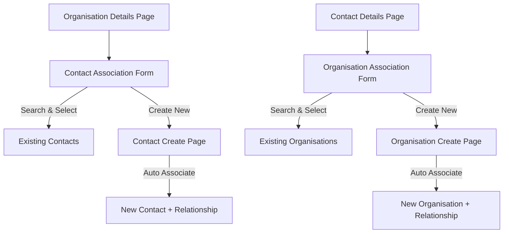

# Contact-Organisation Relationship Implementation Plan

## Current State Analysis

The system currently has:
- A many-to-many relationship between contacts and organisations via the `organisation_contacts` collection
- Basic UI elements for adding contacts to organisations and vice versa
- Services for managing these relationships (`OrganisationContactService`)
- Hooks for accessing these services (`useOrganisationContacts`)

However, the current implementation doesn't provide a way to:
- Search and select existing contacts/organisations
- Create new contacts/organisations with automatic association
- Specify role and primary status during association

## Implementation Plan

### 1. Create Association Components

#### A. Contact Association Component

```typescript
// src/pages/organisations/components/ContactAssociationForm.tsx
```

This component will:
- Display a search field to find existing contacts
- Show search results in a list
- Allow selection of a contact
- Include a form to specify role and primary status
- Provide a link to create a new contact

#### B. Organisation Association Component

```typescript
// src/pages/contacts/components/OrganisationAssociationForm.tsx
```

This component will:
- Display a search field to find existing organisations
- Show search results in a list
- Allow selection of an organisation
- Include a form to specify role and primary status
- Provide a link to create a new organisation

### 2. Update Organisation Details Page

Modify `OrganisationDetails.tsx` to:
- Replace the current "Add Contact" button with an expanded section
- Include the ContactAssociationForm component
- Handle the association process

### 3. Update Contact Details Page

Modify `ContactDetail.tsx` to:
- Replace the current "Add to an organisation" link with an expanded section
- Include the OrganisationAssociationForm component
- Handle the association process

### 4. Update Contact Creation Flow

Modify `ContactCreate.tsx` to:
- Check for `organisationId` in URL parameters
- If present, automatically associate the new contact with the organisation
- Allow specifying role and primary status during creation

### 5. Update Organisation Creation Flow

Modify `OrganisationCreate.tsx` to:
- Check for `contactId` in URL parameters
- If present, automatically associate the new organisation with the contact
- Allow specifying role and primary status during creation

## Component Flow Diagram



## Detailed Component Design

### 1. Contact Association Form

This component will be embedded in the Organisation Details page and will include:

1. **Search Section**:
   - Search input field
   - Search results list showing contact name, email, and role
   - Select button for each result

2. **Association Form**:
   - Role dropdown (Owner, Manager, Staff, Technical Contact, Billing Contact, Other)
   - Primary contact checkbox
   - Add button to create the association

3. **Create New Option**:
   - Link to the Contact Create page with the organisation ID as a parameter

### 2. Organisation Association Form

This component will be embedded in the Contact Details page and will include:

1. **Search Section**:
   - Search input field
   - Search results list showing organisation name, type, and status
   - Select button for each result

2. **Association Form**:
   - Role dropdown
   - Primary contact checkbox
   - Add button to create the association

3. **Create New Option**:
   - Link to the Organisation Create page with the contact ID as a parameter

### 3. Modified Create Pages

Both the Contact Create and Organisation Create pages will be updated to:
- Check for association parameters in the URL
- Include an additional section for role and primary status when an association is being created
- Automatically create the association after the entity is created

## Implementation Steps

1. Create the ContactAssociationForm component
2. Create the OrganisationAssociationForm component
3. Update the OrganisationDetails page to include the ContactAssociationForm
4. Update the ContactDetail page to include the OrganisationAssociationForm
5. Modify the ContactCreate page to handle automatic association
6. Modify the OrganisationCreate page to handle automatic association
7. Test all flows and edge cases

## Files to Modify

1. `src/pages/organisations/OrganisationDetails.tsx`
2. `src/pages/contacts/components/ContactDetail.tsx`
3. `src/pages/contacts/ContactCreate.tsx`
4. `src/pages/organisations/OrganisationCreate.tsx`

## Files to Create

1. `src/pages/organisations/components/ContactAssociationForm.tsx`
2. `src/pages/contacts/components/OrganisationAssociationForm.tsx`