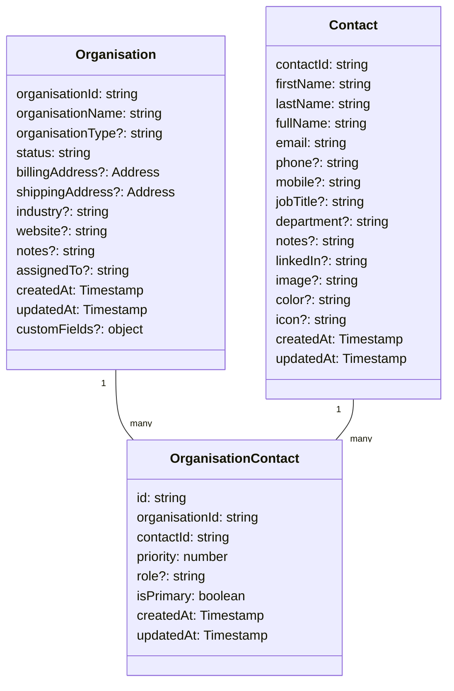
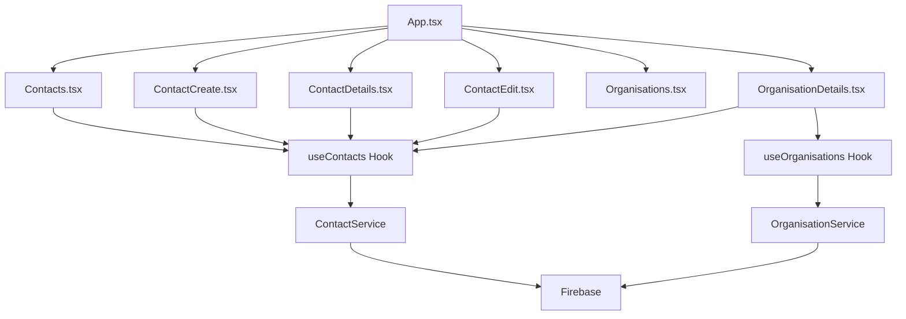

# Contacts Implementation Plan

This document outlines the plan for implementing the contacts functionality in the Jezweb Hub application, including integration with organisations.

## Data Model



## Component Structure



## Implementation Steps

### 1. Remove Unwanted Files
- Remove `src/pages/Contacts/index.tsx` (the list layout we don't want)

### 2. Create Contact Type
- Create `src/types/Contact.ts` with the Contact interface based on the schema
- Add the additional fields requested (mobile, department, LinkedIn, image, color, icon)

### 3. Create OrganisationContact Type
- Create `src/types/OrganisationContact.ts` for the many-to-many relationship
- Include fields for priority and role

### 4. Create Contact Service
- Create `src/services/ContactService.ts` similar to OrganisationService
- Implement CRUD operations for contacts
- Add methods for searching and filtering contacts

### 5. Create OrganisationContact Service
- Create `src/services/OrganisationContactService.ts` for managing the relationship
- Implement methods for adding/removing contacts to/from organisations
- Add methods for updating contact priority and role within an organisation

### 6. Create useContacts Hook
- Create `src/hooks/contacts/useContacts.ts` similar to useOrganisations
- Implement state management and methods for interacting with ContactService

### 7. Create useOrganisationContacts Hook
- Create `src/hooks/organisations/useOrganisationContacts.ts` for managing the relationship
- Implement methods for getting contacts by organisation and organisations by contact

### 8. Update Contacts.tsx Component
- Enhance the existing `src/pages/Contacts.tsx` to use the new hooks
- Implement the card layout for displaying contacts
- Add filtering by organisation, role, and status
- Add functionality for creating, editing, and deleting contacts

### 9. Create Contact Form Components
- Create `src/pages/Contacts/components/ContactForm.tsx` for reusable form
- Implement form validation and submission

### 10. Create Contact Detail Components
- Create `src/pages/Contacts/ContactCreate.tsx` for creating new contacts
- Create `src/pages/Contacts/ContactDetails.tsx` for viewing contact details
- Create `src/pages/Contacts/ContactEdit.tsx` for editing contacts

### 11. Update Organisation Details Component
- Update `src/pages/Organisations/OrganisationDetails.tsx` to display associated contacts
- Add functionality for adding/removing contacts to/from the organisation
- Add functionality for setting contact priority and role within the organisation

### 12. Update App.tsx Routes
- Add routes for the new contact components
- Update existing organisation routes if needed

### 13. Testing
- Test all CRUD operations for contacts
- Test the relationship between contacts and organisations
- Test filtering and searching functionality

## Detailed Component Specifications

### Contact.ts
```typescript
export interface Contact {
  contactId: string;
  firstName: string;
  lastName: string;
  fullName: string;
  email: string;
  phone?: string;
  mobile?: string;
  jobTitle?: string;
  department?: string;
  notes?: string;
  linkedIn?: string;
  image?: string;
  color?: string;
  icon?: string;
  createdAt: Timestamp;
  updatedAt: Timestamp;
}

export interface ContactFormData {
  contactId?: string;
  firstName: string;
  lastName: string;
  email: string;
  phone?: string;
  mobile?: string;
  jobTitle?: string;
  department?: string;
  notes?: string;
  linkedIn?: string;
  image?: string;
  color?: string;
  icon?: string;
}
```

### OrganisationContact.ts
```typescript
export interface OrganisationContact {
  id: string;
  organisationId: string;
  contactId: string;
  priority: number;
  role?: string;
  isPrimary: boolean;
  createdAt: Timestamp;
  updatedAt: Timestamp;
}

export interface OrganisationContactFormData {
  id?: string;
  organisationId: string;
  contactId: string;
  priority: number;
  role?: string;
  isPrimary: boolean;
}
```

### ContactService.ts
This service will handle all CRUD operations for contacts, similar to OrganisationService.

### OrganisationContactService.ts
This service will handle the many-to-many relationship between organisations and contacts.

### useContacts.ts
This hook will provide state management and methods for interacting with ContactService.

### useOrganisationContacts.ts
This hook will provide methods for managing the relationship between organisations and contacts.

### Contacts.tsx
This component will display contacts in a card layout with filtering options.

### ContactForm.tsx
This component will provide a reusable form for creating and editing contacts.

### ContactCreate.tsx, ContactDetails.tsx, ContactEdit.tsx
These components will handle creating, viewing, and editing contacts.

## Firestore Data Structure

For implementing the many-to-many relationship between organisations and contacts in Firestore, we'll use a separate collection approach:

1. `contacts` collection: Stores contact information
2. `organisations` collection: Stores organisation information
3. `organisation_contacts` collection: Stores the relationship between organisations and contacts

This approach is recommended for Firestore when:
- You need to store metadata about relationships (priority, role, isPrimary)
- You need to query relationships efficiently from either direction
- You need to handle potentially large numbers of relationships
- You need to maintain a many-to-many relationship with additional attributes

The `organisation_contacts` collection will have documents with IDs that could be generated as `{organisationId}_{contactId}` or auto-generated by Firestore.