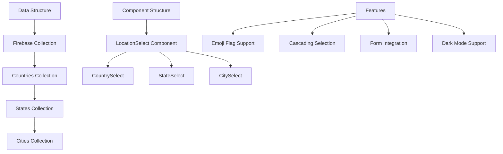

# Country State City Implementation Plan

## Overview
This plan outlines the implementation of a simplified country/state/city selection feature that will replace the current implementation using @davzon/react-country-state-city. The new implementation will be custom-built, focused on commonly used countries, and integrated with Firebase for data storage.

## Data Structure

### Firebase Collections

#### Countries
- Primary countries:
  * Australia 🇦🇺
  * New Zealand 🇳🇿
  * Singapore 🇸🇬
  * Philippines 🇵🇭
  * United States 🇺🇸
  * United Kingdom 🇬🇧

- Secondary countries:
  * Canada 🇨🇦
  * Fiji 🇫🇯
  * Indonesia 🇮🇩
  * Malaysia 🇲🇾
  * Japan 🇯🇵
  * South Korea 🇰🇷

- Metadata per country:
  * ID
  * Name
  * Emoji flag
  * Country code (ISO)
  * Phone code
  * Currency info

#### States
- Linked to country by ID
- Contains:
  * ID
  * Name
  * Country ID
  * State code

#### Cities
- Linked to state by ID
- Contains:
  * ID
  * Name
  * State ID

## Component Architecture

### LocationSelect Component Family
1. Base Component (shared logic)
   - State management via React Context
   - Form field integration
   - Error handling
   - Loading states

2. Individual Components
   - CountrySelect
   - StateSelect
   - CitySelect

### Features
- TailAdmin-styled dropdowns
- Keyboard navigation
- Accessibility support
- Dark mode compatibility
- Loading indicators
- Error states
- Form validation integration

## Firebase Integration

### Services
1. Location Data Service
   - CRUD operations for locations
   - Caching mechanism
   - Data validation
   - Error handling

2. Security Rules
   - Read-only access for client
   - Admin-only write access
   - Rate limiting

### Performance Optimizations
- Data caching
- Lazy loading for states/cities
- Optimized queries
- Offline support

## Testing & Documentation

### Unit Tests
- Component rendering
- State management
- Form integration
- Error handling

### Integration Tests
- Firebase integration
- Form submission
- Data validation

### Documentation
- JSDoc comments
- Usage examples
- Type definitions
- Component API reference