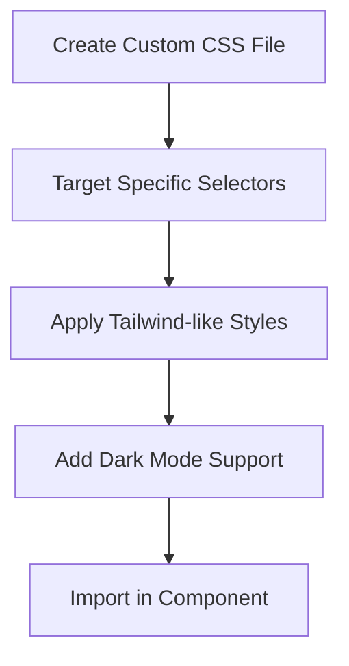

# CountryStateCityField Styling Improvement Plan

## Approach Overview

The best approach to override the library's styles without unintended consequences is to create a dedicated CSS file with targeted selectors. This approach:

1. Keeps styling separate from component logic
2. Provides better maintainability
3. Avoids the pitfalls of using `!important` flags
4. Allows for easy dark mode support



## Implementation Plan

### 1. Create a Custom CSS File

Create a new file at `src/styles/country-state-city-overrides.css` with targeted selectors to override the library's default styles:

```css
/* Target the search box input */
.rcs-country-select .stsearch-box input,
.rcs-state-select .stsearch-box input,
.rcs-city-select .stsearch-box input {
  width: 100%;
  box-sizing: border-box;
  padding: 0.5rem 1rem;
  border: 1px solid #d1d5db; /* border-gray-300 */
  border-radius: 0.5rem; /* rounded-lg */
  font-size: 0.875rem; /* text-sm */
  color: #374151; /* text-gray-700 */
  outline: none;
}

/* Target the dropdown container */
.rcs-country-select .stdropdown-container,
.rcs-state-select .stdropdown-container,
.rcs-city-select .stdropdown-container {
  text-align: left;
  border: 1px solid #d1d5db; /* border-gray-300 */
  position: relative;
  border-radius: 0.5rem; /* rounded-lg */
}

/* Focus styles */
.rcs-country-select .stsearch-box input:focus,
.rcs-state-select .stsearch-box input:focus,
.rcs-city-select .stsearch-box input:focus {
  border-color: #3b82f6; /* focus:border-blue-500 */
  box-shadow: 0 0 0 3px rgba(59, 130, 246, 0.2); /* focus ring effect */
}

/* Dark mode styles */
@media (prefers-color-scheme: dark) {
  .dark .rcs-country-select .stsearch-box input,
  .dark .rcs-state-select .stsearch-box input,
  .dark .rcs-city-select .stsearch-box input {
    background-color: #374151; /* dark:bg-gray-700 */
    border-color: #4b5563; /* dark:border-gray-600 */
    color: white; /* dark:text-white */
  }
  
  .dark .rcs-country-select .stdropdown-container,
  .dark .rcs-state-select .stdropdown-container,
  .dark .rcs-city-select .stdropdown-container {
    background-color: #374151; /* dark:bg-gray-700 */
    border-color: #4b5563; /* dark:border-gray-600 */
    color: white; /* dark:text-white */
  }
  
  /* Dropdown options in dark mode */
  .dark .rcs-country-select .stdropdown-options,
  .dark .rcs-state-select .stdropdown-options,
  .dark .rcs-city-select .stdropdown-options {
    background-color: #374151; /* dark:bg-gray-700 */
    color: white; /* dark:text-white */
  }
  
  .dark .rcs-country-select .stdropdown-options .stdropdown-option:hover,
  .dark .rcs-state-select .stdropdown-options .stdropdown-option:hover,
  .dark .rcs-city-select .stdropdown-options .stdropdown-option:hover {
    background-color: #4b5563; /* dark:hover:bg-gray-600 */
  }
}

/* Disabled state */
.rcs-country-select .stsearch-box input:disabled,
.rcs-state-select .stsearch-box input:disabled,
.rcs-city-select .stsearch-box input:disabled,
.rcs-country-select .stdropdown-container.disabled,
.rcs-state-select .stdropdown-container.disabled,
.rcs-city-select .stdropdown-container.disabled {
  opacity: 0.7;
  cursor: not-allowed;
}

/* Error state */
.country-state-city-error .rcs-country-select .stsearch-box input,
.country-state-city-error .rcs-state-select .stsearch-box input,
.country-state-city-error .rcs-city-select .stsearch-box input,
.country-state-city-error .rcs-country-select .stdropdown-container,
.country-state-city-error .rcs-state-select .stdropdown-container,
.country-state-city-error .rcs-city-select .stdropdown-container {
  border-color: #ef4444; /* border-red-500 */
}

.country-state-city-error .rcs-country-select .stsearch-box input:focus,
.country-state-city-error .rcs-state-select .stsearch-box input:focus,
.country-state-city-error .rcs-city-select .stsearch-box input:focus {
  border-color: #ef4444; /* border-red-500 */
  box-shadow: 0 0 0 3px rgba(239, 68, 68, 0.2); /* red focus ring */
}
```

### 2. Update the CountryStateCityField Component

Modify the CountryStateCityField component to import the custom CSS file:

```tsx
import React, { useState, useEffect } from 'react';
import { CountrySelect, StateSelect, CitySelect, CountryData, StateData, CityData } from '@davzon/react-country-state-city';
import '@davzon/react-country-state-city/dist/react-country-state-city.css';
// Import our custom overrides (must come after the library's CSS)
import '../../../styles/country-state-city-overrides.css';
import Label from '../form/Label';

// Rest of the component remains the same
```

### 3. Remove the Inline Styles

Remove the current inline styles from the component and the `<style>` tag.

### 4. Add Error State Handling

Since we're removing the inline styles that handled error states, we need to add a class-based approach:

```tsx
// Add a CSS class for error state
const errorClass = error ? 'country-state-city-error' : '';

return (
  <div className={`space-y-4 ${className} ${errorClass}`}>
    {/* Component content */}
  </div>
);
```

## Benefits of This Approach

1. **Maintainability**: Keeping styles in a separate CSS file makes them easier to maintain and update
2. **Specificity**: Using targeted selectors ensures we only override what we need
3. **No !important flags**: Avoids the pitfalls of using !important, which can make future styling changes difficult
4. **Clean component code**: Removes styling logic from the component, making it cleaner and more focused
5. **Consistent styling**: Ensures the country, state, and city selectors match the rest of the form inputs

## Testing Plan

After implementing these changes, we should test:

1. Light and dark mode appearance
2. Error state styling
3. Disabled state styling
4. Focus state styling
5. Responsive behavior