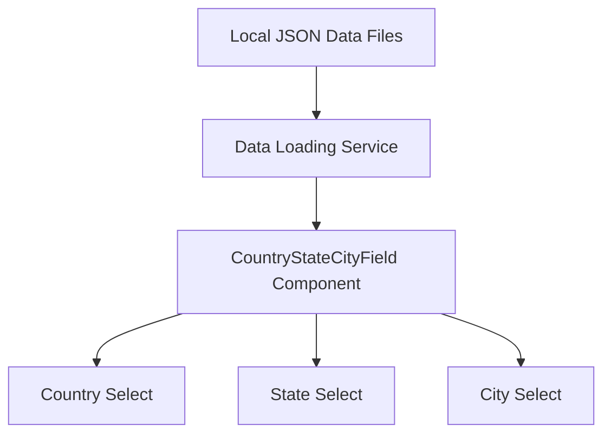
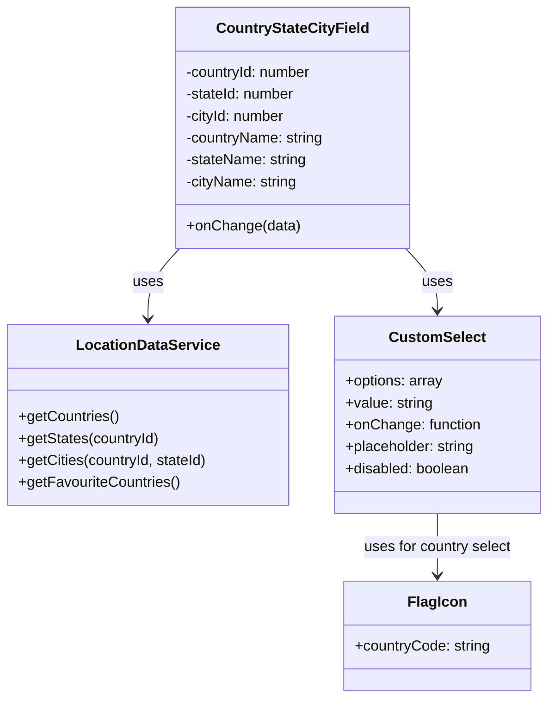
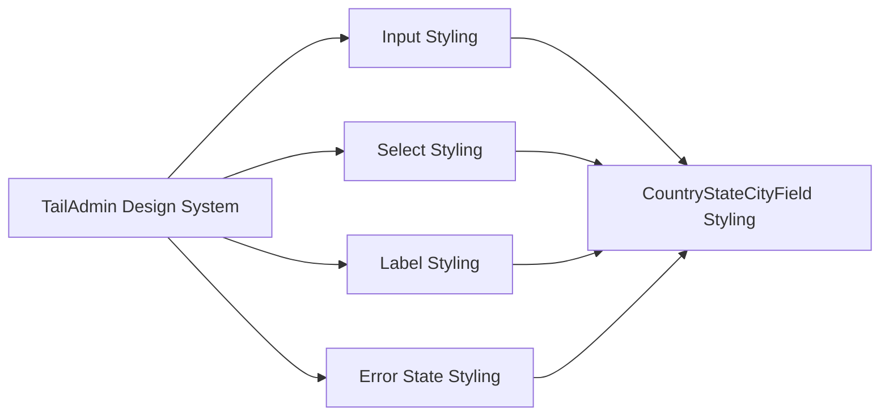

# Custom CountryStateCityField Component Implementation Plan

Based on analysis of the current implementation, this plan outlines the approach for implementing a custom CountryStateCityField component that addresses styling issues and adds requested features.

## Current Issues

1. **Styling Inconsistency**: The current component doesn't match the TailAdmin styling, especially in dark mode.
2. **External Data Dependency**: The component fetches data from GitHub repositories, which could lead to reliability issues if those repositories change or become unavailable.
3. **No Favourite Countries**: There's no way to prioritise frequently used countries like AU, NZ, SG, UK, US.
4. **Default Country**: Australia isn't set as the default country, which would be convenient for primarily Australian client base.

## Implementation Plan

### 1. Data Management Approach

We'll create a hybrid approach for data management:

- **Store data locally**: We'll download and store the country, state, and city data locally in JSON files to ensure reliability.
- **Maintain data structure**: We'll keep the same data structure as the original package to minimise changes to the component interface.
- **Add data versioning**: We'll include a version number in the data files to make future updates easier.



### 2. Component Structure

We'll create a custom implementation with the following components:

1. **LocationDataService**: A service to load and manage location data.
2. **CountryStateCityField**: The main component that orchestrates the selection process.
3. **CustomSelect**: A reusable select component styled according to TailAdmin guidelines.
4. **FlagIcon**: A component to display country flags.



### 3. Styling Improvements

We'll implement styling that matches the TailAdmin design system:

- Use the same border styles, colours, and focus states as other form components.
- Implement proper dark mode support.
- Ensure consistent spacing and typography.
- Add proper error state styling.



### 4. Feature Enhancements

1. **Favourite Countries**:
   - Add a "Favourites" section at the top of the country dropdown.
   - Include AU, NZ, SG, UK, US in this section.
   - Add a visual separator between favourites and other countries.

2. **Default Selection**:
   - Set Australia as the default country when no initial value is provided.

3. **Search/Filter Improvements**:
   - Enhance the search functionality to match on country codes and partial names.
   - Optimise search performance for large datasets.

4. **Accessibility Improvements**:
   - Add proper ARIA labels and roles.
   - Ensure keyboard navigation works correctly.
   - Add screen reader support.

### 5. Implementation Steps

1. **Data Preparation**:
   - Download the country, state, and city data from the GitHub repositories.
   - Process and optimise the data for local storage.
   - Add favourite country flags to the data structure.

2. **Component Implementation**:
   - Create the LocationDataService to manage data loading and filtering.
   - Implement the CustomSelect component based on the TailAdmin design system.
   - Build the FlagIcon component for country flags.
   - Implement the main CountryStateCityField component.

3. **Styling Implementation**:
   - Create CSS styles that match the TailAdmin design system.
   - Implement dark mode support.
   - Add responsive styling for different screen sizes.

4. **Testing**:
   - Test the component with various initial values.
   - Verify that the cascading selection works correctly.
   - Test dark mode and error states.
   - Ensure accessibility requirements are met.

5. **Integration**:
   - Update the ContactForm component to use the new CountryStateCityField.
   - Verify that the data is correctly passed to and from the component.

### 6. File Structure

```
src/
├── components/
│   └── custom/
│       ├── CountryStateCityField.tsx       # Main component
│       ├── CustomSelect.tsx                # Reusable select component
│       └── FlagIcon.tsx                    # Country flag component
├── services/
│   └── LocationDataService.ts              # Data loading and management
├── data/
│   ├── countries.json                      # Country data
│   ├── states.json                         # State data
│   └── cities.json                         # City data
└── styles/
    └── country-state-city.css              # Component-specific styles
```

## Benefits of This Approach

1. **Reliability**: By storing data locally, we eliminate dependency on external repositories.
2. **Consistency**: The component will match the TailAdmin design system, including dark mode.
3. **User Experience**: Favourite countries and default selection will improve usability.
4. **Performance**: Local data and optimised search will improve performance.
5. **Maintainability**: Clean code structure and separation of concerns will make future updates easier.

## Timeline Estimate

- Data preparation: 1-2 hours
- Component implementation: 3-4 hours
- Styling implementation: 2-3 hours
- Testing and refinement: 2-3 hours
- Integration: 1-2 hours

Total: 9-14 hours