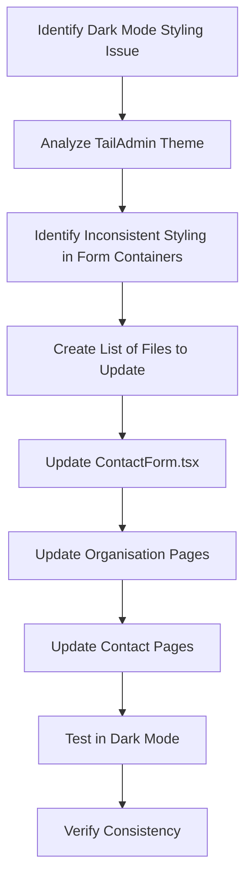

# Dark Mode Styling Fix for Form Containers

## Problem Statement

The form containers in our application have inconsistent dark mode styling compared to the TailAdmin theme. Specifically:

- TailAdmin uses `dark:bg-white/[0.03]` (white with 3% opacity) for a subtle dark effect
- Our forms use `dark:bg-boxdark` which is too dark in dark mode
- Border colors are also inconsistent (`dark:border-strokedark` vs `dark:border-gray-800`)
- Rounded corners may be inconsistent (`rounded-sm` vs `rounded-2xl`)

This inconsistency is causing the form containers to appear too dark in dark mode, making them hard to see and inconsistent with the TailAdmin theme's styling approach.

## Files Needing Updates

The following files need to be updated:

1. src/pages/organisations/OrganisationCreate.tsx
2. src/pages/organisations/OrganisationEdit.tsx
3. src/pages/organisations/OrganisationDetails.tsx
4. src/pages/contacts/ContactCreate.tsx
5. src/pages/contacts/ContactEdit.tsx
6. src/pages/contacts/components/ContactDetail.tsx
7. src/pages/contacts/components/ContactForm.tsx (this is used by both ContactCreate and ContactEdit)

## Proposed Changes

For each file, we need to:

1. Find all instances of container divs with the class `dark:bg-boxdark`
2. Replace `dark:bg-boxdark` with `dark:bg-white/[0.03]`
3. Replace `dark:border-strokedark` with `dark:border-gray-800`
4. Replace `rounded-sm` with `rounded-2xl` to match TailAdmin style

### Example Change

From:
```jsx
<div className="rounded-sm border border-stroke bg-white p-6 shadow-default dark:border-strokedark dark:bg-boxdark">
```

To:
```jsx
<div className="rounded-2xl border border-stroke bg-white p-6 shadow-default dark:border-gray-800 dark:bg-white/[0.03]">
```

## Implementation Plan

1. First, we'll update the ContactForm.tsx component since it's used by both ContactCreate.tsx and ContactEdit.tsx
2. Then, we'll update the remaining files one by one
3. We'll test each change in dark mode to ensure the styling is consistent and visually appealing

## Detailed Steps

### Step 1: Update ContactForm.tsx

In ContactForm.tsx, we need to update all form container divs. There are multiple instances:
- Personal Information section
- Professional Information section
- Organisation Associations section
- Additional Information section

### Step 2: Update Organisation Pages

Update the container divs in:
- OrganisationCreate.tsx
- OrganisationEdit.tsx
- OrganisationDetails.tsx

### Step 3: Update Contact Pages

Update the container divs in:
- ContactCreate.tsx
- ContactEdit.tsx
- ContactDetail.tsx

### Step 4: Test in Dark Mode

After making all changes, we need to test the application in dark mode to ensure:
- All form containers have consistent styling
- The form elements are clearly visible against the background
- The overall look is consistent with the TailAdmin theme

## Implementation Diagram



## Benefits of This Approach

1. **Consistency**: All form containers will have the same dark mode styling
2. **Improved Visibility**: The lighter background will make form elements more visible in dark mode
3. **Alignment with TailAdmin**: Our styling will be consistent with the TailAdmin theme
4. **Better User Experience**: Dark mode will be more usable and aesthetically pleasing

## Potential Challenges

1. **CSS Specificity**: We need to ensure our changes don't conflict with other styles
2. **Comprehensive Testing**: We need to test all pages in both light and dark mode
3. **Responsive Design**: We need to ensure the changes work well on all screen sizes

## Conclusion

By updating the dark mode styling for form containers across the application, we'll create a more consistent and visually appealing user experience in dark mode. This change aligns our styling with the TailAdmin theme and improves the visibility of form elements in dark mode.