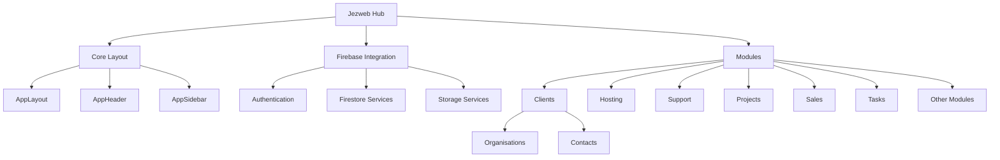

# Documentation Update Plan for Jezweb Hub

This document outlines the plan for updating the README.md file and creating a CHANGELOG.md file for the Jezweb Hub project.

## 1. Update README.md

The current README.md contains information about TailAdmin Pro, but we need to update it to reflect the Jezweb Hub project. Here's what we'll include:

### Content Structure

1. **Project Title & Description**: Brief introduction to Jezweb Hub
2. **Features**: List of key features and modules
3. **Technology Stack**: Technologies used (React, Firebase, etc.)
4. **Installation & Setup**: Instructions for setting up the project
5. **Project Structure**: Overview of the codebase organization
6. **Usage**: How to use the application
7. **Contributing**: Guidelines for contributing to the project
8. **License**: License information

### Project Structure Diagram

## 2. Create CHANGELOG.md

The CHANGELOG.md file will track all notable changes to the project. We'll use the following structure:

### Content Structure

1. **Introduction**: Brief explanation of the changelog's purpose
2. **Version History**: Chronological list of versions with changes
   - Each version will include:
     - Version number
     - Release date
     - Changes categorized as:
       - Added (new features)
       - Changed (changes in existing functionality)
       - Deprecated (features that will be removed)
       - Removed (removed features)
       - Fixed (bug fixes)
       - Security (security fixes)

### Initial Entries

- The first entry will be the initial release (v1.0.0)
- Recent entries will include the form field enhancements we just implemented:
  - Dynamic form fields stored in Firebase
  - Autocomplete industry field implementation

## Implementation Steps

1. Create a new README.md file with the updated content
2. Create a new CHANGELOG.md file with the initial structure and entries
3. Ensure both files use EN-AU spelling and grammar
4. Include appropriate links and references in both files

This plan will ensure that the documentation accurately reflects the Jezweb Hub project and provides a clear structure for tracking changes in the future.