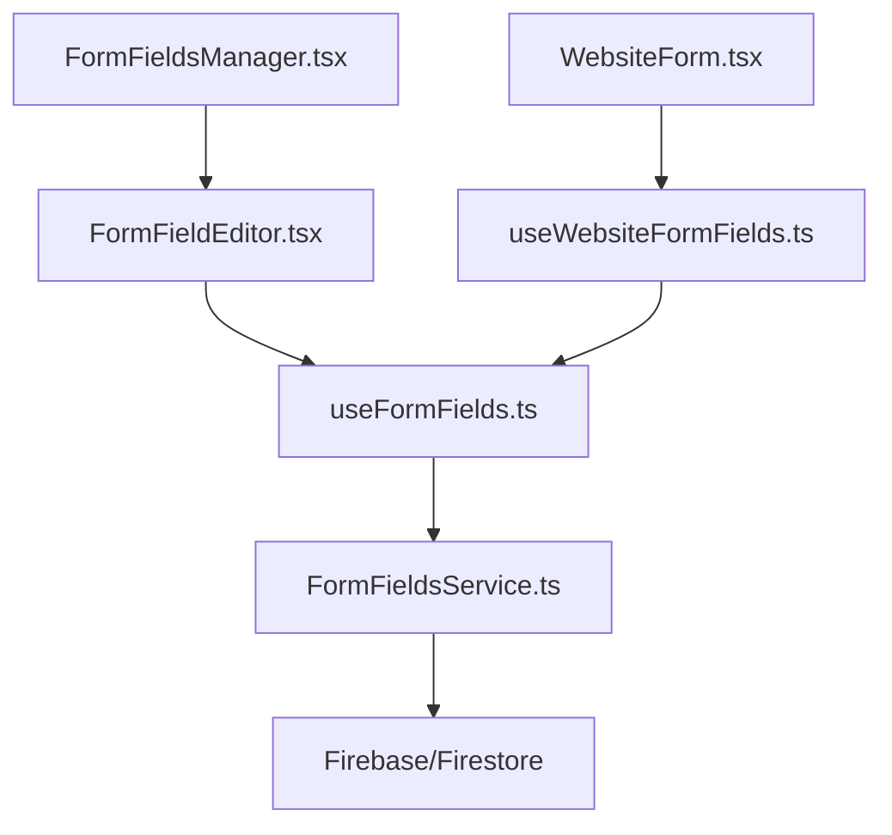

# Form Fields Manager Analysis

## Current Implementation

After analyzing the codebase, I've found that the functionality you're requesting is already implemented in the application. Here's how the current system works:

### FormFieldsManager.tsx

The `FormFieldsManager.tsx` component already includes tabs for managing:
- Website Statuses
- Hosting Providers
- CMS Types

These are defined in the `tabs` array (lines 32-39):

```typescript
const tabs = [
  { id: 'contactRoles', label: 'Contact Roles' },
  { id: 'contactStatuses', label: 'Contact Statuses' },
  { id: 'industries', label: 'Industries' },
  { id: 'websiteStatuses', label: 'Website Statuses' },
  { id: 'hostingProviders', label: 'Hosting Providers' },
  { id: 'cmsTypes', label: 'CMS Types' }
];
```

### WebsiteForm.tsx

The `WebsiteForm.tsx` component is already using the `useWebsiteFormFields` hook to fetch these managed field values:

```typescript
// Load form field values from FormFieldsManager using the custom hook
const {
  statusValues,
  hostingProviderValues,
  cmsTypeValues,
  loading: loadingFieldValues
} = useWebsiteFormFields();
```

These values are then used in the form's select inputs:

```typescript
{/* Status */}
<select
  id="status"
  name="status"
  value={formData.status || ''}
  onChange={handleChange}
  className={/* ... */}
  disabled={isSubmitting || loadingFieldValues}
>
  <option value="">Select Status</option>
  {statusValues.length > 0 ? (
    statusValues.map(status => (
      <option key={status.id} value={status.value}>
        {status.label}
      </option>
    ))
  ) : (
    // Fallback options if no managed values are available
    <>
      <option value="active">Active</option>
      <option value="inactive">Inactive</option>
      <option value="development">Development</option>
      <option value="staging">Staging</option>
      <option value="suspended">Suspended</option>
    </>
  )}
</select>
```

Similar implementations exist for Hosting Provider and CMS Type.

### useWebsiteFormFields.ts

The `useWebsiteFormFields.ts` hook is specifically designed to fetch these form field values:

```typescript
export const useWebsiteFormFields = (): WebsiteFormFields => {
  // Use separate instances of useFormFields for each field type
  const {
    fieldValues: statusValues,
    loading: loadingStatuses,
    error: statusError,
    fetchFieldValues: fetchStatusValues
  } = useFormFields('websiteStatuses');
  
  const {
    fieldValues: hostingProviderValues,
    loading: loadingHostingProviders,
    error: hostingProvidersError,
    fetchFieldValues: fetchHostingProviderValues
  } = useFormFields('hostingProviders');
  
  const {
    fieldValues: cmsTypeValues,
    loading: loadingCmsTypes,
    error: cmsTypesError,
    fetchFieldValues: fetchCmsTypeValues
  } = useFormFields('cmsTypes');
  
  // ...
}
```

### FormFieldsService.ts

The `FormFieldsService.ts` provides the functions for interacting with the form field values stored in Firebase:

```typescript
// Get the collection reference for a specific field type
const getFieldCollection = (fieldType: string) => {
  return collection(db, 'formFields', fieldType, 'values');
};

// Get all field values for a specific field type
export const getFieldValues = async (fieldType: string): Promise<FieldValue[]> => {
  try {
    const fieldCollection = getFieldCollection(fieldType);
    const q = query(fieldCollection, orderBy('order', 'asc'), orderBy('label', 'asc'));
    const snapshot = await getDocs(q);
    
    return snapshot.docs.map(doc => ({
      id: doc.id,
      ...doc.data()
    } as FieldValue));
  } catch (error) {
    console.error(`Error fetching ${fieldType} field values:`, error);
    throw new Error(`Failed to fetch ${fieldType} field values: ${error instanceof Error ? error.message : 'Unknown error'}`);
  }
};
```

## Data Flow

The data flow for these form fields is as follows:



1. The `FormFieldsManager.tsx` component provides a UI for managing form field values.
2. Each tab uses the `FormFieldEditor.tsx` component to edit a specific field type.
3. The `FormFieldEditor.tsx` component uses the `useFormFields.ts` hook to interact with the data.
4. The `useFormFields.ts` hook uses the `FormFieldsService.ts` to interact with Firebase.
5. The `WebsiteForm.tsx` component uses the `useWebsiteFormFields.ts` hook to fetch the form field values.
6. The `useWebsiteFormFields.ts` hook uses the `useFormFields.ts` hook to fetch the values for each field type.

## Conclusion

The functionality you're requesting is already implemented in the application. The Website Status, Hosting Provider, and CMS Type fields in the WebsiteEdit.tsx page are already being managed through the FormFieldsManager.tsx component.

If you're experiencing issues with this functionality, or if you'd like to make changes to how it's implemented, please let me know and I can help you with that.