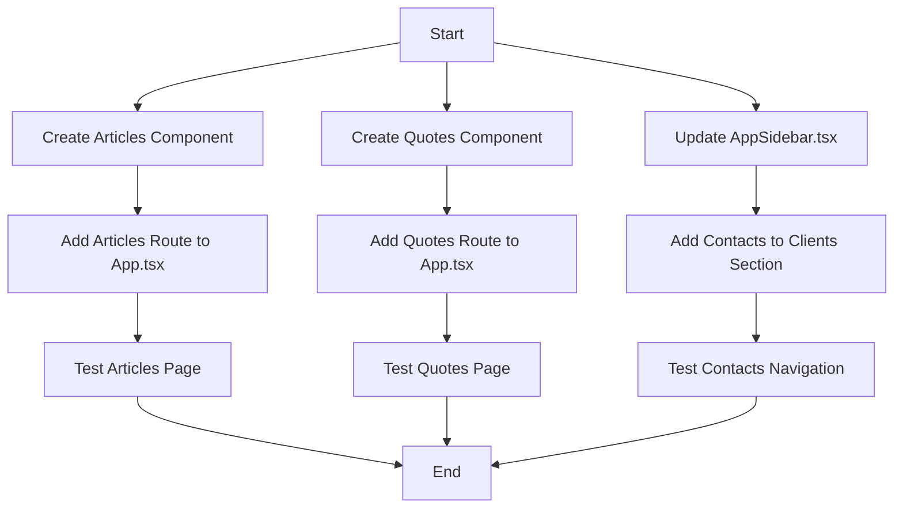

# Implementation Plan: Fix 404 Errors and Update Sidebar Navigation

## Overview

This document outlines the implementation plan for fixing 404 errors for the Quotes and Articles pages, and updating the sidebar navigation to include Contacts under the Clients section.

## Current State Assessment

1. The sidebar navigation in `AppSidebar.tsx` contains links to:
   - `/quotes` (in the Sales section)
   - `/articles` (as a main menu item)
   - `/contacts` (already exists as a route in App.tsx)

2. The routes for `/quotes` and `/articles` are missing in `App.tsx`, causing 404 errors.

3. The Contacts component already exists but needs to be added to the Clients section in the sidebar.

## Implementation Plan



### 1. Create Articles Component

Create a new component at `src/pages/Articles.tsx` based on the schema in `planning/articles-schema.md`. This component will:
- Display a list of articles
- Include search and filtering functionality
- Provide a way to create, edit, and delete articles
- Follow the same UI pattern as other components in the system

#### Component Structure

```typescript
// Articles.tsx
import React from "react";

/**
 * Articles Page Component
 * 
 * This component displays and manages articles in the Jezweb Hub system.
 * It provides functionality to view, search, filter, create, edit, and delete articles.
 * 
 * @returns {JSX.Element} The rendered Articles page
 */
const Articles: React.FC = () => {
  return (
    <div className="p-4 sm:p-6 lg:p-8">
      <div className="mb-6">
        <h1 className="text-2xl font-semibold text-gray-900 dark:text-white">
          Articles
        </h1>
        <p className="mt-2 text-gray-600 dark:text-gray-400">
          Manage reusable article content
        </p>
      </div>

      {/* Action Bar */}
      <div className="mb-6 flex flex-wrap items-center justify-between gap-4">
        {/* Search and filters */}
        {/* Add Article button */}
      </div>

      {/* Articles Grid */}
      <div className="grid grid-cols-1 gap-6 md:grid-cols-2 lg:grid-cols-3">
        {/* Empty State */}
        {/* Article Card Template */}
      </div>
    </div>
  );
};

export default Articles;
```

### 2. Create Quotes Component

Create a new component at `src/pages/Quotes.tsx` based on the schema in `planning/quotes-schema.md`. This component will:
- Display a list of quotes
- Include search and filtering functionality
- Provide a way to create, edit, and delete quotes
- Follow the same UI pattern as other components in the system

#### Component Structure

```typescript
// Quotes.tsx
import React from "react";

/**
 * Quotes Page Component
 * 
 * This component displays and manages quotes/proposals in the Jezweb Hub system.
 * It provides functionality to view, search, filter, create, edit, and delete quotes.
 * 
 * @returns {JSX.Element} The rendered Quotes page
 */
const Quotes: React.FC = () => {
  return (
    <div className="p-4 sm:p-6 lg:p-8">
      <div className="mb-6">
        <h1 className="text-2xl font-semibold text-gray-900 dark:text-white">
          Quotes
        </h1>
        <p className="mt-2 text-gray-600 dark:text-gray-400">
          Manage quotes and proposals
        </p>
      </div>

      {/* Action Bar */}
      <div className="mb-6 flex flex-wrap items-center justify-between gap-4">
        {/* Search and filters */}
        {/* Add Quote button */}
      </div>

      {/* Quotes Grid */}
      <div className="grid grid-cols-1 gap-6 md:grid-cols-2 lg:grid-cols-3">
        {/* Empty State */}
        {/* Quote Card Template */}
      </div>
    </div>
  );
};

export default Quotes;
```

### 3. Update AppSidebar.tsx

Modify the `AppSidebar.tsx` file to add "Contacts" as a submenu item under the "Clients" section, after the "Organisations" item.

#### Changes to AppSidebar.tsx

```typescript
// Current structure
{
  icon: <UserCircleIcon />,
  name: "Clients",
  path: "/clients",
  subItems: [
    { name: "Organisations", path: "/organisations" },
  ],
}

// Updated structure
{
  icon: <UserCircleIcon />,
  name: "Clients",
  path: "/clients",
  subItems: [
    { name: "Organisations", path: "/organisations" },
    { name: "Contacts", path: "/contacts" },
  ],
}
```

### 4. Add Routes to App.tsx

Update the `App.tsx` file to add routes for:
- `/quotes` pointing to the Quotes component
- `/articles` pointing to the Articles component

#### Changes to App.tsx

```typescript
// Add imports
import Articles from "./pages/Articles";
import Quotes from "./pages/Quotes";

// Add routes within the AppLayout route
<Route path="/quotes" element={<Quotes />} />
<Route path="/articles" element={<Articles />} />
```

## Testing Plan

1. **Test Articles Page**:
   - Navigate to the Articles page via the sidebar
   - Verify the page loads correctly
   - Test search and filtering functionality
   - Test creating, editing, and deleting articles

2. **Test Quotes Page**:
   - Navigate to the Quotes page via the sidebar
   - Verify the page loads correctly
   - Test search and filtering functionality
   - Test creating, editing, and deleting quotes

3. **Test Contacts Navigation**:
   - Verify the Contacts link appears in the Clients section
   - Verify clicking the link navigates to the Contacts page

## Implementation Considerations

1. **Component Structure**: Follow the existing component structure and patterns in the application.
2. **UI Consistency**: Maintain UI consistency with other components in the system.
3. **Schema Alignment**: Ensure the components align with the schema definitions.
4. **Error Handling**: Implement proper error handling for data fetching and operations.
5. **Responsive Design**: Ensure the components work well on different screen sizes.