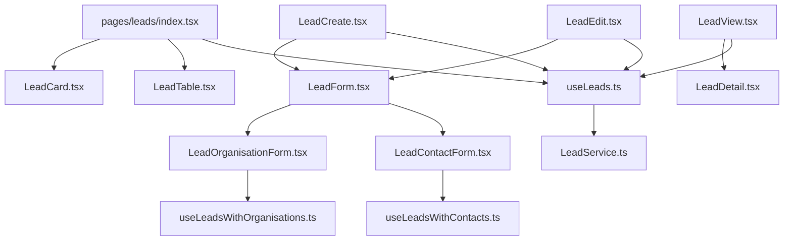

# Leads Management System Implementation Plan

Based on our analysis of the project structure and requirements, this document outlines a comprehensive plan for implementing the Leads Management System. This plan follows the established patterns in the project while incorporating all the requested features.

## File Structure

```
src/
├── pages/
│   ├── Leads.tsx (to be replaced with index.tsx in the new structure)
│   └── leads/
│       ├── index.tsx (main leads listing page with table/card toggle)
│       ├── LeadCreate.tsx (create new lead)
│       ├── LeadEdit.tsx (edit existing lead)
│       ├── LeadView.tsx (detailed view of a lead)
│       └── components/
│           ├── LeadCard.tsx (card view component)
│           ├── LeadTable.tsx (table view component)
│           ├── LeadForm.tsx (form for create/edit)
│           ├── LeadDetail.tsx (detailed information display)
│           ├── LeadOrganisationForm.tsx (for linking to organisations)
│           └── LeadContactForm.tsx (for linking to contacts)
├── services/
│   └── LeadService.ts (CRUD operations for leads)
├── hooks/
│   └── leads/
│       ├── useLeads.ts (main hook for lead operations)
│       ├── useLeadsWithOrganisations.ts (for organisation relationships)
│       └── useLeadsWithContacts.ts (for contact relationships)
└── types/
    └── Lead.ts (type definitions for leads)
```

## Component Architecture

Here's a diagram showing the component relationships:



## Implementation Steps

### 1. Type Definitions

Create the Lead type definitions based on the schema provided in `planning/leads-schema.md`.

### 2. Service Layer

Implement the `LeadService.ts` with the following methods:
- `createLead(leadData: LeadFormData): Promise<string>`
- `getLeadById(leadId: string): Promise<Lead | null>`
- `getLeads(filters?, sortField?, sortDirection?, maxResults?): Promise<Lead[]>`
- `updateLead(leadId: string, leadData: Partial<LeadFormData>): Promise<void>`
- `deleteLead(leadId: string): Promise<void>`
- `searchLeads(searchTerm: string, maxResults?: number): Promise<Lead[]>`
- `getLeadsByOrganisation(organisationId: string): Promise<Lead[]>`
- `getLeadsByContact(contactId: string): Promise<Lead[]>`

### 3. Hook Layer

Implement the following hooks:

#### useLeads.ts
Similar to `useWebsites.ts`, providing:
- Data states (leads, selectedLead)
- Loading states (loading, loadingLead, submitting)
- Error states (error, leadError, submitError)
- CRUD operations (fetchLeads, fetchLeadById, createLead, updateLead, deleteLead)
- Search and filter operations (searchLeads, getLeadsByOrganisation, getLeadsByContact)

#### useLeadsWithOrganisations.ts
For managing the relationship between leads and organisations.

#### useLeadsWithContacts.ts
For managing the relationship between leads and contacts.

### 4. Form Field Management

Update the `FormFieldsManager.tsx` component to include:
- Lead Status management
- Lead Source management

This will require adding new tabs to the component and updating the corresponding hooks.

### 5. UI Components

#### index.tsx (Main Leads Page)
- Implement a view toggle between card and table views
- Include filtering by status, source, and search functionality
- Add a "Create Lead" button

#### LeadCard.tsx and LeadTable.tsx
- Display lead information in card and table formats
- Include action buttons (view, edit, delete)
- Show status with appropriate styling

#### LeadForm.tsx
- Form for creating and editing leads
- Fields for all lead properties
- Integration with form field values (statuses, sources)
- Organisation and contact selection

#### LeadDetail.tsx
- Detailed view of a lead
- Display all lead information
- Show related organisation and contacts

#### LeadOrganisationForm.tsx and LeadContactForm.tsx
- Components for managing relationships with organisations and contacts

### 6. Main Page Components

#### LeadCreate.tsx
- Page for creating a new lead
- Uses LeadForm.tsx

#### LeadEdit.tsx
- Page for editing an existing lead
- Uses LeadForm.tsx
- Pre-populates form with existing lead data

#### LeadView.tsx
- Page for viewing lead details
- Uses LeadDetail.tsx
- Includes options to edit or delete the lead

## Additional Features

### Advanced Filtering and Sorting
- Implement filtering by multiple criteria (status, source, date range)
- Allow sorting by different fields (name, date, status)

### Dashboard Integration
- Add lead statistics to the dashboard
- Show recent leads and conversion rates

### Notifications
- Notify users of new leads
- Remind users of leads that need follow-up

### Export Functionality
- Allow exporting leads to CSV or Excel

## Implementation Approach

1. Start with the type definitions and service layer
2. Implement the hooks for data management
3. Update the FormFieldsManager for lead statuses and sources
4. Create the UI components
5. Implement the main page components
6. Add advanced features

This modular approach allows for incremental development and testing.

## Data Flow

```mermaid
flowchart TD
    A[User Interface] <--> B[Hooks Layer]
    B <--> C[Service Layer]
    C <--> D[Firebase/Firestore]
    
    subgraph "UI Components"
    A1[LeadCard] --> A
    A2[LeadTable] --> A
    A3[LeadForm] --> A
    A4[LeadDetail] --> A
    end
    
    subgraph "Hooks"
    B1[useLeads] --> B
    B2[useLeadsWithOrganisations] --> B
    B3[useLeadsWithContacts] --> B
    end
    
    subgraph "Services"
    C1[LeadService] --> C
    end
    
    subgraph "Database"
    D1[leads Collection] --> D
    D2[organisations Collection] --> D
    D3[contacts Collection] --> D
    end