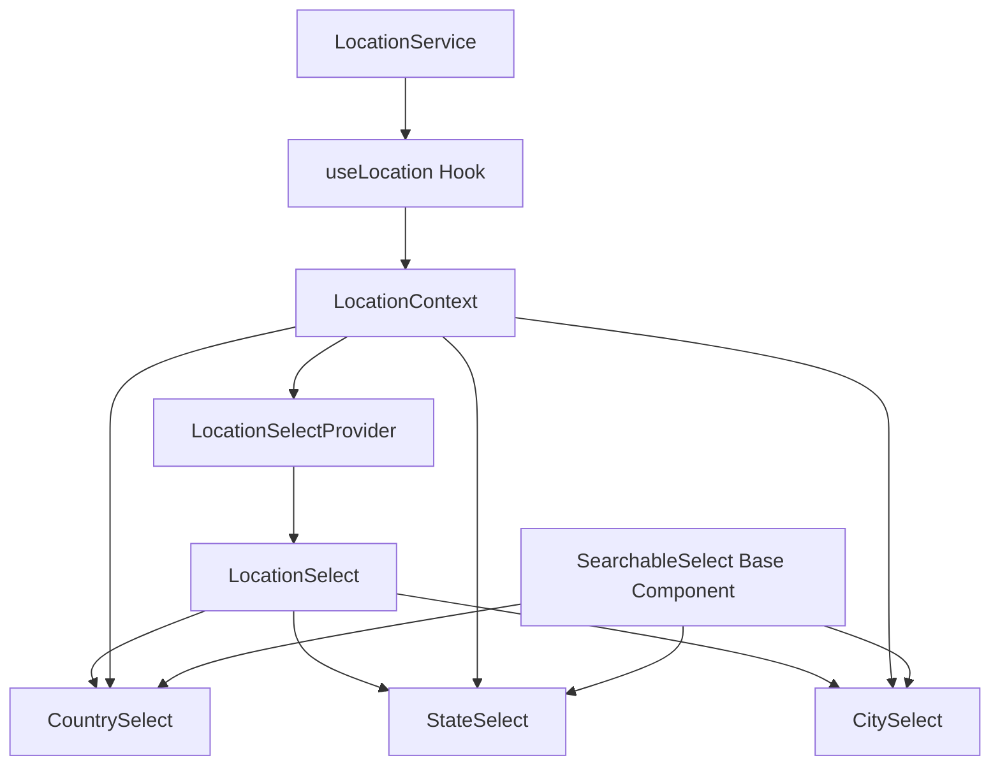
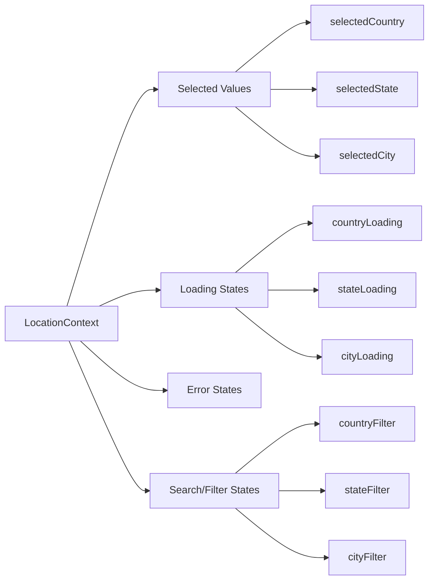
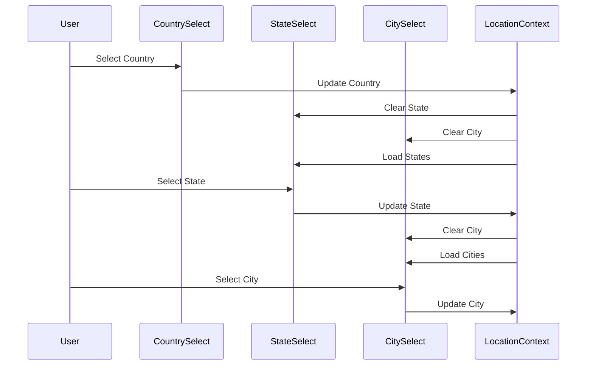
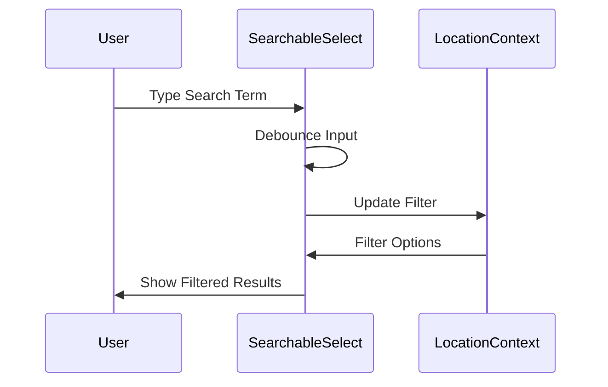

# LocationSelect Component Architecture Design

## Component Hierarchy and Relationships



## State Management Approach



## Component Interfaces

### LocationSelectProvider
```typescript
interface LocationContextValue {
  // Selected values
  selectedCountry: Country | null;
  selectedState: State | null;
  selectedCity: City | null;
  
  // Loading states
  isLoadingCountries: boolean;
  isLoadingStates: boolean;
  isLoadingCities: boolean;
  
  // Error states
  error: Error | null;
  
  // Actions
  setSelectedCountry: (country: Country | null) => void;
  setSelectedState: (state: State | null) => void;
  setSelectedCity: (city: City | null) => void;
  clearSelection: () => void;
  
  // Data
  countries: Country[];
  states: State[];
  cities: City[];
}

interface LocationProviderProps {
  children: React.ReactNode;
  defaultCountry?: string;
  required?: boolean;
}
```

### Base Types
```typescript
interface Country {
  id: string;
  name: string;
  emoji: string;
  code: string;
  phoneCode: string;
  currency: {
    code: string;
    symbol: string;
  };
}

interface State {
  id: string;
  name: string;
  countryId: string;
  stateCode: string;
}

interface City {
  id: string;
  name: string;
  stateId: string;
}
```

### SearchableSelect (Base Component)
```typescript
interface SearchableSelectProps<T> {
  items: T[];
  value: T | null;
  onChange: (value: T | null) => void;
  loading?: boolean;
  error?: Error | null;
  placeholder?: string;
  noOptionsMessage?: string;
  filterOption: (item: T, searchValue: string) => boolean;
  getOptionLabel: (item: T) => string;
  getOptionValue: (item: T) => string;
  disabled?: boolean;
  required?: boolean;
  className?: string;
}
```

### LocationSelect Components
```typescript
interface LocationSelectProps {
  value?: {
    country?: string;
    state?: string;
    city?: string;
  };
  onChange?: (value: {
    country: string | null;
    state: string | null;
    city: string | null;
  }) => void;
  required?: boolean;
  className?: string;
}

interface CountrySelectProps {
  className?: string;
}

interface StateSelectProps {
  className?: string;
}

interface CitySelectProps {
  className?: string;
}
```

## Integration with Form System

```typescript
// useLocation Hook
interface UseLocationResult {
  // Selected values
  selectedCountry: Country | null;
  selectedState: State | null;
  selectedCity: City | null;
  
  // Form field value
  value: {
    country: string | null;
    state: string | null;
    city: string | null;
  };
  
  // Loading states
  isLoading: boolean;
  
  // Error handling
  error: Error | null;
  
  // Actions
  setCountry: (country: Country | null) => void;
  setState: (state: State | null) => void;
  setCity: (city: City | null) => void;
  reset: () => void;
  
  // Form integration
  fieldProps: {
    name: string;
    value: string;
    onChange: (event: any) => void;
    onBlur: () => void;
  };
}
```

## Interaction Patterns

1. **Cascading Selection**


2. **Search/Filter Flow**


## Key Features and Implementation Details

1. **Firebase Integration**
```typescript
class LocationService {
  // Fetch methods with caching
  async getCountries(): Promise<Country[]>;
  async getStates(countryId: string): Promise<State[]>;
  async getCities(stateId: string): Promise<City[]>;
  
  // Search methods
  async searchCountries(term: string): Promise<Country[]>;
  async searchStates(countryId: string, term: string): Promise<State[]>;
  async searchCities(stateId: string, term: string): Promise<City[]>;
}
```

2. **Accessibility Features**
- ARIA labels and roles
- Keyboard navigation
- Screen reader support
- Focus management

3. **Error Handling**
- Network errors
- Invalid selections
- Loading states
- Fallback UI

4. **Performance Optimizations**
- Debounced search
- Memoized components
- Lazy loading of options
- Firebase query optimization