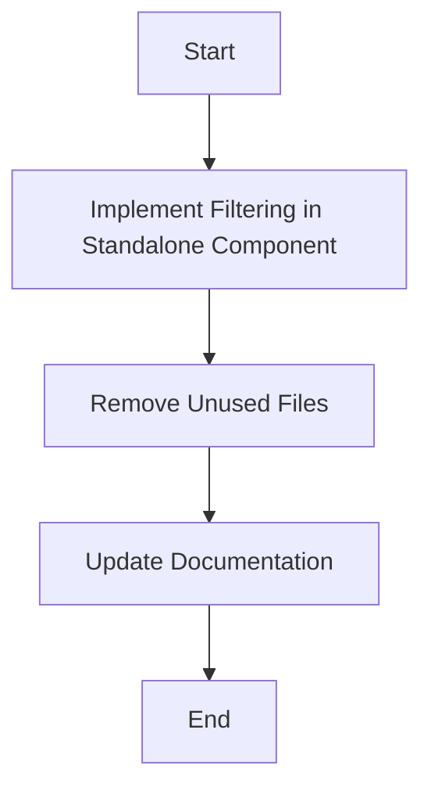

# Organisations Component Consolidation Plan

## Current Situation
- The standalone component (`src/pages/Organisations.tsx`) is already showing real data from Firebase
- The filters at the top of the card list are not functional
- The Details and Edit buttons in the card UI are working correctly
- App.tsx is correctly importing the standalone component

## Implementation Plan

### Step 1: Implement Filtering in Standalone Component
- Update `src/pages/Organisations.tsx` to make the filters functional:
  - Implement search functionality
  - Implement type filtering (All Types dropdown)
  - Implement status filtering (All Statuses dropdown)
  - Implement sorting (Name A-Z dropdown)

### Step 2: Remove Unused Files
- Remove `src/pages/Organisations/index.tsx`
- Consider whether to keep the OrganisationList component for future reference

### Step 3: Update Documentation
- Update comments in the standalone component to reflect its role and relationship with sub-components

## Implementation Details

### Filtering Implementation
1. Add state variables for search term, type filter, status filter, and sort order
2. Connect these state variables to the input fields and dropdowns
3. Implement filtering logic to filter the organisations based on these criteria
4. Update the UI to show filtered results

### File Removal
1. Remove `src/pages/Organisations/index.tsx` as it's no longer needed
2. Keep the OrganisationList component for potential future use in other parts of the application

### Documentation Updates
1. Update comments in `src/pages/Organisations.tsx` to explain its role and relationship with sub-components
2. Ensure all components have proper documentation