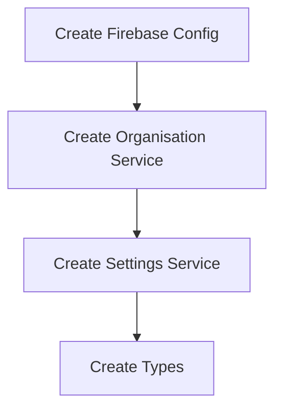
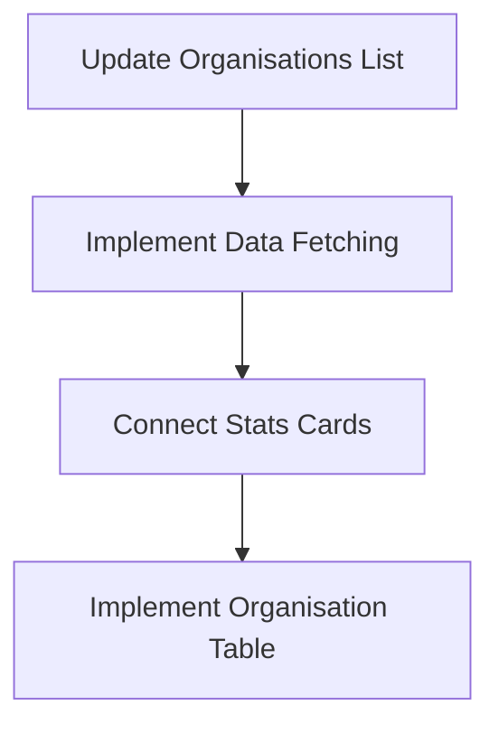
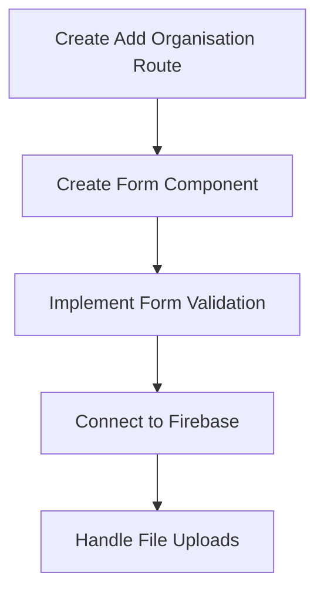
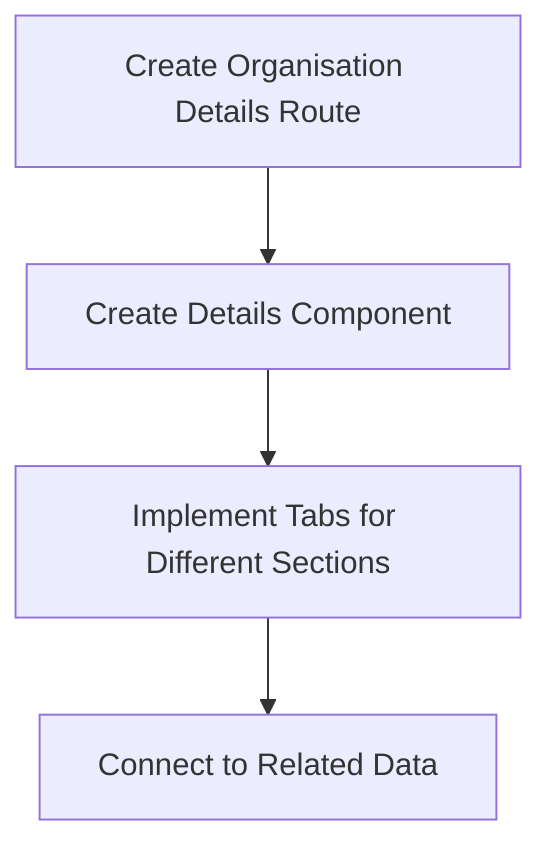
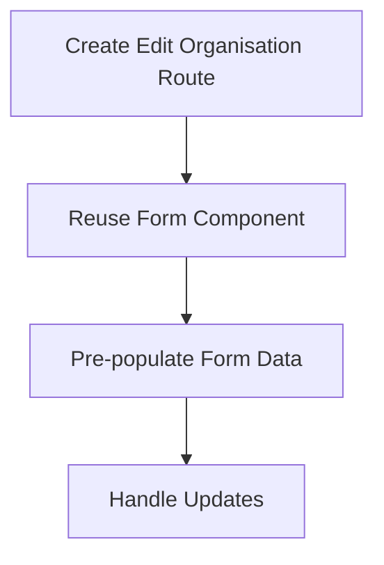
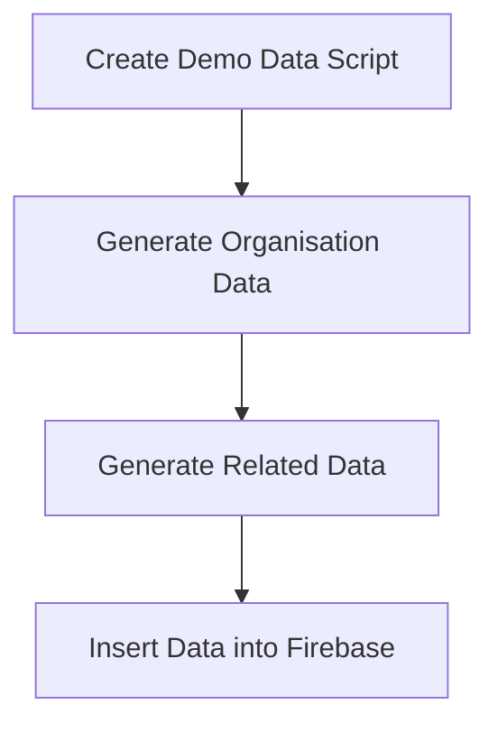

# Organisations Implementation Plan

## Overview

This document outlines the implementation plan for the Organisations functionality in the Jezweb Hub system. The plan includes setting up Firebase integration, creating necessary services, and implementing the UI components for managing organisations.

## Implementation Principles

- **Modularity**: Create reusable components and services that can be easily extended
- **Documentation**: Include comprehensive comments and descriptions in each file
- **Component Size**: Keep components reasonably small for easier management
- **SOLID Principles**: Follow SOLID development principles
- **Language**: Use EN-AU spelling and grammar throughout the application

## Implementation Phases

### Phase 1: Firebase Integration Setup



#### 1.1 Firebase Configuration
- Create a Firebase configuration file (`src/firebase/config.ts`)
- Set up Firebase initialization
- Configure Firestore and Firebase Storage

#### 1.2 Organisation Service
- Create an organisation service (`src/services/organisationService.ts`) with CRUD operations:
  - `getOrganisations()`
  - `getOrganisationById(id: string)`
  - `createOrganisation(organisation: OrganisationType)`
  - `updateOrganisation(id: string, organisation: Partial<OrganisationType>)`
  - `deleteOrganisation(id: string)`
  - `getOrganisationsByType(type: string)`
  - `getOrganisationsByStatus(status: string)`

#### 1.3 Settings Service for Dropdown Options
- Create a settings service (`src/services/settingsService.ts`) to manage dropdown options
- Store settings in a dedicated Firestore collection (`settings`)
- Implement caching to reduce Firestore reads
- Structure settings documents by category:
  ```typescript
  interface SettingsDocument {
    category: string; // e.g., "organisationTypes", "organisationStatuses"
    options: {
      value: string;
      label: string;
      order?: number;
      active?: boolean;
    }[];
    lastUpdated: Timestamp;
  }
  ```
- Create functions to:
  - `getSettingsByCategory(category: string)`
  - `updateSettingsByCategory(category: string, options: OptionType[])`
  - `addOptionToCategory(category: string, option: OptionType)`
  - `removeOptionFromCategory(category: string, optionValue: string)`
  - `updateOptionInCategory(category: string, optionValue: string, newOption: Partial<OptionType>)`

#### 1.4 TypeScript Types
- Create types file (`src/types/organisation.ts`) based on the schema
- Add additional fields as suggested:
  ```typescript
  interface Organisation {
    organisationId: string;
    organisationName: string;
    organisationType?: string;
    status: string;
    primaryContactId?: string;
    billingAddress?: Address;
    shippingAddress?: Address;
    industry?: string;
    website?: string;
    notes?: string;
    assignedTo?: string;
    createdAt: Timestamp;
    updatedAt: Timestamp;
    customFields?: Record<string, any>;
    // Additional fields
    logo?: string; // URL to logo image in Firebase Storage
    colour?: string; // Brand colour (hex code)
    icon?: string; // Icon identifier
    tags?: string[]; // Array of tags
  }
  ```

### Phase 2: Organisations List Page Updates



#### 2.1 Update Organisations List Page
- Update `src/pages/Organisations/index.tsx` to fetch and display real data
- Connect the "Add Organisation" button to the new route
- Implement filtering and sorting functionality

#### 2.2 Implement Data Fetching
- Use React hooks to fetch organisations data
- Create a custom hook (`useOrganisations`) for data fetching and state management
- Implement loading states and error handling
- Add pagination for large datasets

#### 2.3 Connect Stats Cards
- Update stats cards to show real counts:
  - Total Organisations (from organisations collection)
  - Total Clients (organisations with type "Client")
  - Active Projects (count from projects collection with matching organisationId)
  - Pending Tasks (count from tasks collection with matching organisationId)
- Implement real-time updates using Firebase listeners

#### 2.4 Implement Organisation Table
- Display organisations in the table with:
  - Organisation Name
  - Type
  - Website
  - Phone
  - Clients Count
  - Actions (View, Edit, Delete)
- Add sorting functionality for columns
- Implement row selection for bulk actions
- Add confirmation dialogs for destructive actions

### Phase 3: Add Organisation Page



#### 3.1 Create Add Organisation Route
- Create a new route for adding organisations (`/organisations/add`)
- Create a new component (`src/pages/Organisations/AddOrganisation.tsx`)
- Add navigation and breadcrumbs

#### 3.2 Create Form Component
- Create a form with fields based on the organisation schema
- Group fields into logical sections:
  - Basic Information (name, type, status, industry, website)
  - Contact Information (phone, email)
  - Addresses (billing, shipping)
  - Additional Information (notes, tags, logo, colour)
- Use dropdown selectors for type, status, and industry (populated from settings service)
- Implement multi-step form for better UX

#### 3.3 Implement Form Validation
- Add validation for required fields
- Add format validation for website, email, phone
- Implement real-time validation feedback
- Add error messages for validation failures

#### 3.4 Connect to Firebase
- Connect form submission to the organisation service
- Implement success/error handling
- Add loading indicators during submission
- Redirect to organisation details page after successful creation

#### 3.5 Handle File Uploads
- Implement logo upload functionality using Firebase Storage
- Add image preview and cropping functionality
- Implement progress indicators for uploads
- Add validation for file types and sizes

### Phase 4: Organisation Details Page



#### 4.1 Create Organisation Details Route
- Create a new route for viewing organisation details (`/organisations/:id`)
- Create a new component (`src/pages/Organisations/OrganisationDetails.tsx`)
- Implement loading states for data fetching

#### 4.2 Create Details Component
- Display all organisation information in a well-organized layout
- Add edit and delete functionality
- Implement responsive design for different screen sizes
- Add print functionality for organisation details

#### 4.3 Implement Tabs for Different Sections
- Create tabs for different sections of organisation data:
  - Overview (basic information)
  - Contacts
  - Projects
  - Websites
  - Tasks
  - Notes
- Implement lazy loading for tab content
- Add URL parameters to preserve tab state

#### 4.4 Connect to Related Data
- Fetch and display related data:
  - Contacts associated with the organisation
  - Projects for the organisation
  - Websites managed for the organisation
  - Tasks related to the organisation
- Implement pagination for related data lists
- Add quick actions for related data (e.g., add contact, create task)

### Phase 5: Edit Organisation Page



#### 5.1 Create Edit Organisation Route
- Create a new route for editing organisations (`/organisations/:id/edit`)
- Create a new component (`src/pages/Organisations/EditOrganisation.tsx`)
- Add navigation and breadcrumbs

#### 5.2 Reuse Form Component
- Reuse the form component from the Add Organisation page
- Add a mode prop to toggle between "add" and "edit" modes
- Implement conditional rendering based on mode

#### 5.3 Pre-populate Form Data
- Fetch organisation data and pre-populate the form
- Handle loading states
- Implement error handling for failed data fetching

#### 5.4 Handle Updates
- Connect form submission to the organisation service's update function
- Implement optimistic updates for better UX
- Add confirmation for changes
- Implement change tracking to only update modified fields

### Phase 6: Demo Data Creation



#### 6.1 Create Demo Data Script
- Create a utility script for generating and inserting demo data
- Implement functions for generating realistic data

#### 6.2 Generate Organisation Data
- Create a variety of organisation types (clients, vendors, partners)
- Generate realistic organisation names, addresses, and contact information
- Create different statuses (active, inactive, lead, prospect)

#### 6.3 Generate Related Data
- Create contacts associated with organisations
- Generate projects linked to organisations
- Create tasks related to organisations

#### 6.4 Insert Data into Firebase
- Use Firebase batch operations for efficient writes
- Implement error handling for failed writes
- Add logging for successful data insertion

## Additional Considerations

### Performance Optimizations
- Use pagination for large lists
- Implement query caching
- Use Firestore compound queries for efficient filtering
- Implement lazy loading for related data
- Use Firebase batch operations for multiple writes

### Security Considerations
- Implement Firestore security rules
- Add validation on the server side
- Sanitize user inputs
- Implement proper error handling

### Accessibility
- Ensure proper ARIA attributes
- Implement keyboard navigation
- Use semantic HTML
- Ensure sufficient color contrast
- Add screen reader support

### Testing
- Write unit tests for services
- Implement component tests
- Add integration tests for form submissions
- Test error handling and edge cases

## Success Criteria

The implementation will be considered successful when:

1. Users can view a list of organisations with filtering and sorting
2. Users can add new organisations with all required fields
3. Users can view detailed information about an organisation
4. Users can edit organisation details
5. Users can delete organisations
6. The system displays related data for each organisation
7. Demo data is available for testing and demonstration
8. All components are properly documented
9. The code follows SOLID principles and is modular
10. The UI is responsive and accessible