# Project Hubs Architecture Plan

This document outlines the high-level architecture for the five project hubs (Website, Graphics, App, SEO, and Content) in the Jezweb Hub application.

## Overview

The project hubs follow a consistent architecture pattern while accommodating the specific requirements of each project type. This architecture is designed to be modular, maintainable, and extensible, following SOLID principles and the design system guidelines.

## Component Structure

### Page Components

Each project hub has two main page components:

1. **List/Grid View Page** (e.g., `WebsiteProjects.tsx`, `GraphicsProjects.tsx`)
   - Displays a list or grid of projects
   - Provides filtering, sorting, and search functionality
   - Allows switching between table and card views
   - Includes actions for creating, viewing, editing, and deleting projects

2. **Detail View Page** (e.g., `WebsiteProjectView.tsx`, `GraphicsProjectView.tsx`)
   - Displays detailed information about a specific project
   - Provides actions for editing, deleting, and changing project status
   - Shows project-specific information in a structured layout

### Shared Components

The following components are shared across all project hubs:

1. **ProjectCard**: Displays a project in card format with key information and actions
2. **ProjectTable**: Displays projects in a table format with sortable columns
3. **ProjectFilters**: Provides filtering options for projects
4. **ViewToggle**: Allows switching between table and card views
5. **ProjectDetail**: Displays detailed project information in a structured layout

### Data Hooks

Each project type has a dedicated hook for data management:

1. **useWebsiteProjects**: Manages website project data
2. **useGraphicsProjects**: Manages graphics project data
3. **useAppProjects**: Manages app project data
4. **useSeoProjects**: Manages SEO project data
5. **useContentProjects**: Manages content project data

These hooks encapsulate all data fetching, creation, updating, and deletion logic, providing a clean interface for the components to interact with the data.

## Data Flow

The data flow follows a unidirectional pattern:

1. **Data Fetching**: The hooks fetch data from Firestore collections
2. **State Management**: The hooks manage the state of the data (loading, error, data)
3. **Component Rendering**: The components render based on the state provided by the hooks
4. **User Interaction**: User actions (e.g., filtering, sorting, creating, editing) trigger functions in the hooks
5. **Data Update**: The hooks update the data in Firestore and update the local state

## Common Patterns

### Project List/Grid View

All project list/grid views follow this pattern:

```jsx
const ProjectsPage = () => {
  // Get projects data and actions from the hook
  const { projects, loading, error, fetchProjects, deleteProject, searchProjects } = useProjects();
  
  // State for view mode, filters, and sorting
  const [viewMode, setViewMode] = useState('table');
  const [filters, setFilters] = useState({ /* ... */ });
  const [sortField, setSortField] = useState('createdAt');
  const [sortDirection, setSortDirection] = useState('desc');
  
  // Fetch projects on component mount
  useEffect(() => {
    fetchProjects();
  }, [fetchProjects]);
  
  // Handle filter changes, apply filters, reset filters
  // Handle sort changes
  // Handle view, edit, delete actions
  
  return (
    <Container>
      <PageHeading title="Projects" description="..." actions={/* ... */} />
      
      <ProjectFilters /* ... */ />
      
      <ViewToggle viewMode={viewMode} onViewModeChange={setViewMode} />
      
      {viewMode === 'table' ? (
        <ProjectTable projects={projects} /* ... */ />
      ) : (
        <div className="grid gap-6 sm:grid-cols-2 lg:grid-cols-3">
          {projects.map(project => (
            <ProjectCard key={project.projectId} project={project} /* ... */ />
          ))}
        </div>
      )}
    </Container>
  );
};
```

### Project Detail View

All project detail views follow this pattern:

```jsx
const ProjectView = () => {
  const { projectId } = useParams();
  
  // Get project data and actions from the hook
  const { selectedProject, loading, error, fetchProjectById, updateProject, deleteProject } = useProjects();
  
  // Fetch project data on component mount
  useEffect(() => {
    if (projectId) {
      fetchProjectById(projectId);
    }
  }, [projectId, fetchProjectById]);
  
  // Handle status change, edit, delete actions
  
  return (
    <Container>
      <PageHeading 
        title={selectedProject?.projectName} 
        description="..." 
        backLink={{ to: '/projects/...', label: 'Back to Projects' }}
      />
      
      <div className="grid gap-6 lg:grid-cols-3">
        <div className="lg:col-span-2">
          <ProjectDetail 
            project={selectedProject}
            onEdit={handleEditProject}
            onDelete={handleDeleteProject}
            onStatusChange={handleStatusChange}
            additionalSections={/* Project-specific sections */}
          />
        </div>
        
        <div className="space-y-6">
          {/* Sidebar cards for additional information */}
        </div>
      </div>
    </Container>
  );
};
```

## Project-Specific Customizations

While the overall architecture is consistent, each project type has specific customizations:

### Website Projects

- **Additional Fields**: Domain, hosting provider, CMS type
- **Specific Features**: Website preview, domain status check

### Graphics Projects

- **Additional Fields**: Graphics type, deliverables, design requirements
- **Specific Features**: Color palette display, asset management

### App Projects

- **Additional Fields**: App type, platforms, features
- **Specific Features**: Version tracking, app store links

### SEO Projects

- **Additional Fields**: SEO type, target keywords, analytics
- **Specific Features**: Keyword performance tracking, competitor analysis

### Content Projects

- **Additional Fields**: Content type, word count, target audience
- **Specific Features**: Content calendar, revision tracking

## Implementation Approach

The implementation follows these principles:

1. **Consistency**: All project hubs follow the same architectural pattern
2. **Modularity**: Components are small, focused, and reusable
3. **Separation of Concerns**: Data logic is separated from UI components
4. **Design System Compliance**: All components use the design system
5. **Type Safety**: TypeScript interfaces ensure type safety across the application
6. **Error Handling**: Comprehensive error handling at all levels
7. **Loading States**: Clear loading states for better user experience
8. **Responsive Design**: All components are responsive across device sizes

## Mermaid Diagram: Component Relationships

```mermaid
graph TD
    subgraph "Project Hub Pages"
        WebsiteProjects
        GraphicsProjects
        AppProjects
        SEOProjects
        ContentProjects
        
        WebsiteProjectView
        GraphicsProjectView
        AppProjectView
        SEOProjectView
        ContentProjectView
    end
    
    subgraph "Shared Components"
        ProjectCard
        ProjectTable
        ProjectFilters
        ViewToggle
        ProjectDetail
    end
    
    subgraph "Data Hooks"
        useWebsiteProjects
        useGraphicsProjects
        useAppProjects
        useSeoProjects
        useContentProjects
    end
    
    subgraph "Firestore Collections"
        websiteProjects[(websiteProjects)]
        graphicsProjects[(graphicsProjects)]
        appProjects[(appProjects)]
        seoProjects[(seoProjects)]
        contentProjects[(contentProjects)]
    end
    
    WebsiteProjects --> useWebsiteProjects
    GraphicsProjects --> useGraphicsProjects
    AppProjects --> useAppProjects
    SEOProjects --> useSeoProjects
    ContentProjects --> useContentProjects
    
    WebsiteProjectView --> useWebsiteProjects
    GraphicsProjectView --> useGraphicsProjects
    AppProjectView --> useAppProjects
    SEOProjectView --> useSeoProjects
    ContentProjectView --> useContentProjects
    
    useWebsiteProjects --> websiteProjects
    useGraphicsProjects --> graphicsProjects
    useAppProjects --> appProjects
    useSeoProjects --> seoProjects
    useContentProjects --> contentProjects
    
    WebsiteProjects --> ProjectCard
    WebsiteProjects --> ProjectTable
    WebsiteProjects --> ProjectFilters
    WebsiteProjects --> ViewToggle
    
    GraphicsProjects --> ProjectCard
    GraphicsProjects --> ProjectTable
    GraphicsProjects --> ProjectFilters
    GraphicsProjects --> ViewToggle
    
    AppProjects --> ProjectCard
    AppProjects --> ProjectTable
    AppProjects --> ProjectFilters
    AppProjects --> ViewToggle
    
    SEOProjects --> ProjectCard
    SEOProjects --> ProjectTable
    SEOProjects --> ProjectFilters
    SEOProjects --> ViewToggle
    
    ContentProjects --> ProjectCard
    ContentProjects --> ProjectTable
    ContentProjects --> ProjectFilters
    ContentProjects --> ViewToggle
    
    WebsiteProjectView --> ProjectDetail
    GraphicsProjectView --> ProjectDetail
    AppProjectView --> ProjectDetail
    SEOProjectView --> ProjectDetail
    ContentProjectView --> ProjectDetail
```



## Conclusion

This architecture provides a consistent, modular, and maintainable approach to implementing the five project hubs. By following this architecture, we ensure that:

1. Users have a consistent experience across all project types
2. Developers can easily understand and extend the codebase
3. New project types can be added with minimal effort
4. Changes to shared components automatically benefit all project hubs
5. The application follows best practices and design system guidelines