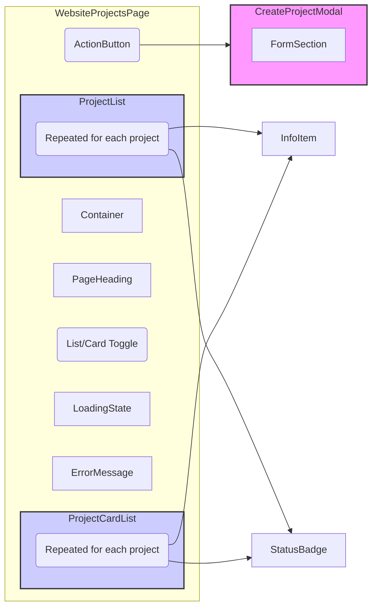

# Project Hubs Implementation Plan

This document outlines the plan for implementing the five project hubs (Website, Graphics, App, SEO, and Content) in the application.

## Goal

Replace the existing pages in `src/pages/Projects/` with new implementations that:

*   Follow the design system defined in `docs/design-system.md`.
*   Use components from `src/components/ui/design-system/`.
*   Provide a consistent user interface for managing different project types.
*   Allow switching between list and card views.
*   Include filtering by status and sorting by creation/due date.
*   Enable creation of new projects.
*   Provide a detailed view for each project.

## Component Structure

Each project hub (Website, Graphics, App, SEO, and Content) will have its own page component within `src/pages/Projects/`. These page components will have the following structure:

*   **Container:** Uses the `Container` component from the design system for consistent layout and maximum width.
*   **PageHeading:** Uses the `PageHeading` component for the page title, optional description, and a back link (if applicable).
*   **View Toggle:** Includes a toggle mechanism (likely using `ActionButton` components) to switch between list and card views.
*   **ProjectList / ProjectCardList:** Two sub-components will be implemented:
    *   `ProjectList`: Displays projects in a list format.
    *   `ProjectCardList`: Displays projects in a card format.
    *   Only one of these will be visible at a time, based on the view toggle.
*   **ProjectListItem / ProjectCard:**  These components represent individual projects within the list or card view. They will display a summary of key project details:
    *   Project Name
    *   Organization
    *   Status (using `StatusBadge`)
    *   Assigned User
    *   Project-specific details (e.g., `appType` for App projects, `keywords` for SEO projects)
*   **Add Project Button:** An `ActionButton` that allows users to create a new project of the corresponding type.
*   **Loading State:** Uses the `LoadingState` component while fetching project data.
*   **Error Message:** Uses the `ErrorMessage` component to display errors, if any occur.

## Data Fetching

Each project hub page will fetch data from the corresponding Firestore collection:

*   `websiteProjects`
*   `graphicsProjects`
*   `appProjects`
*   `seoProjects`
*   `contentProjects`

This will be achieved by creating custom hooks (e.g., `useWebsiteProjects`, `useGraphicsProjects`, etc.) that encapsulate the data fetching logic and provide loading/error states.

## Shared Components

The following design system components will be reused across all project hubs:

*   `Container`
*   `PageHeading`
*   `Card`
*   `ActionButton`
*   `ErrorMessage`
*   `LoadingState`
*   `StatusBadge`
*   `InfoItem`

## Project-Specific Components

While the core structure will be similar, each project hub page may have some unique elements based on its specific data.  These project-specific details can be incorporated within the `ProjectListItem` / `ProjectCard` components or as additional `InfoItem` components. Examples:

*   **Website Hub:** Might display a link to the website (if `websiteId` is present).
*   **App Hub:** Might display the `appType`.
*   **SEO Hub:** Might display the `keywords`.
*   **Content Hub:** Might display the `contentType`.

## Routing

The existing routing structure in `src/App.tsx` will be updated to include routes for:

*   The new project hub pages (e.g., `/projects/website`, `/projects/graphics`, etc.).
*   Detailed project view pages (e.g., `/projects/website/:projectId`).
*   Create project pages (e.g., `/projects/website/create`).

## Navigation
Links in the application that currently go to the old project pages will be updated to link to the new project hub pages.

## Create Project

*   Each hub page will have an "Add Project" button (`ActionButton`).
*   Clicking this button will either:
    *   Open a modal dialog containing the project creation form.
    *   Navigate to a separate "create project" page (e.g., `/projects/[projectType]/create`).
*   The create project form will:
    *   Use design system components (`FormSection`, and appropriate form field components).
    *   Follow the relevant project schema (e.g., `website-projects-schema.md`).
    *   Handle form submission and data creation in Firestore.

## Detailed Project View

*   Clicking on a project in the list/card view will navigate to a detailed project view page (e.g., `/projects/website/:projectId`).
*   The layout of this page will be similar to `src/pages/quotes/QuoteView.tsx`.
*   The page will display all relevant project details.
*   Consider using tabs or a similar mechanism to organize different sections of information (e.g., "Details," "Tasks," "Notes").

## Filtering and Sorting

*   **Filtering:** Implement filtering by project `status`.
*   **Sorting:** Implement sorting by `createdAt` (creation date) and `dueDate` (due date).

## Styling

*   Use Tailwind CSS classes for styling, adhering to the "tailadmin" style and the design system guidelines.
*   Examine existing components in `src/components` for potential styling patterns to reuse, but prioritize consistency with the design system.

## Implementation Steps

1.  **Create Page Components:** Create the five new page components in `src/pages/Projects/`:
    *   `WebsiteProjectsPage.tsx`
    *   `GraphicsProjectsPage.tsx`
    *   `AppProjectsPage.tsx`
    *   `SEOProjectsPage.tsx`
    *   `ContentProjectsPage.tsx`
2.  **Implement Shared Layout:** Implement the basic layout for each page using the design system components (`Container`, `PageHeading`, `Card`, `ActionButton`, etc.). Include the view toggle for list/card view.
3.  **Create Data Fetching Hooks:** Create hooks (e.g., `useWebsiteProjects`) in the `src/hooks` directory to fetch data from the corresponding Firestore collections. These hooks should handle loading and error states.
4.  **Implement Project List/Card Display:** Create the `ProjectList` and `ProjectCardList` components and implement the display of projects within each page, using the `Card` and `InfoItem` components.
5.  **Add Project-Specific Details:** Incorporate any project-specific details within the `ProjectListItem` / `ProjectCard` components.
6.  **Implement Filtering and Sorting:** Add UI elements (e.g., dropdowns, buttons) and logic for filtering and sorting the project lists.
7.  **Implement Create Project Functionality:**
    *   Add the "Add Project" button.
    *   Implement the modal or separate page for creating new projects.
    *   Create the form using design system components.
    *   Handle form submission and data creation in Firestore.
8.  **Implement Detailed Project View:**
    *   Create the detailed project view page (e.g., `WebsiteProjectDetails.tsx`).
    *   Implement the layout based on `src/pages/quotes/QuoteView.tsx`.
    *   Fetch and display all relevant project data.
9.  **Update Routing:** Update `src/App.tsx` to include routes for the new pages (hub pages, detail pages, create pages).
10. **Update Navigation:** Update links to point to the new project hub pages.
11. **Testing:** Thoroughly test each page and feature to ensure:
    *   Data is displayed correctly.
    *   Loading and error states are handled gracefully.
    *   The design system is consistently applied.
    *   Filtering and sorting work as expected.
    *   Project creation and detail view function correctly.
    *   Responsiveness and accessibility are maintained.

## Mermaid Diagram (Component Hierarchy)

This diagram shows the component hierarchy for the `WebsiteProjectsPage`. The other project hub pages will have a similar structure.