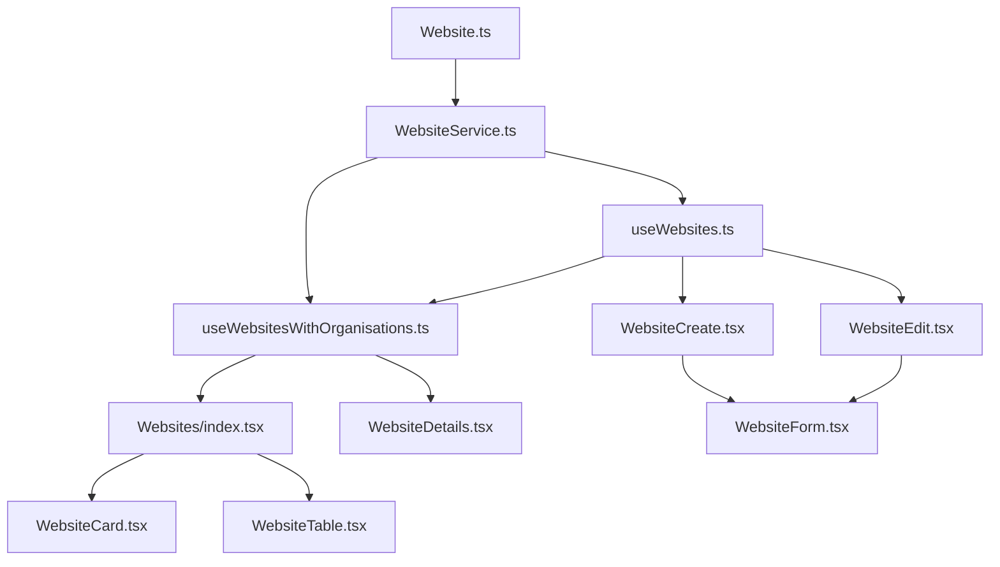

# Websites Implementation Plan

## Overview

This plan outlines the steps to:
1. Implement the full website management system based on the schema in `planning/websites-schema.md`
2. Create a modular, extensible structure following the patterns used in the organisations and contacts features

## File Structure - DONE!

We'll create the following file structure for the Websites feature:

```
src/
├── types/
│   └── Website.ts                  # Website type definitions
├── services/
│   └── WebsiteService.ts           # Service for CRUD operations
├── hooks/
│   └── websites/
│       ├── useWebsites.ts          # Main hook for website management
│       └── useWebsiteWithOrganisation.ts  # Hook for website-organisation relationship
├── pages/
│   └── Websites/
│       ├── index.tsx               # Main Websites page
│       ├── WebsiteCreate.tsx       # Create new website page
│       ├── WebsiteEdit.tsx         # Edit website page
│       ├── WebsiteDetails.tsx      # Website details page
│       └── components/             # Website-specific components
│           ├── WebsiteCard.tsx     # Card view component
│           ├── WebsiteTable.tsx    # Table view component
│           ├── WebsiteForm.tsx     # Form for create/edit
│           └── WebsiteDetail.tsx   # Detail view component
```

## Implementation Steps


### 1. Update Main Websites Page (index.tsx) - check if done, might be partly done

modify it to use the new hooks and components:

```typescript
import React, { useState, useEffect } from "react";
import { Helmet } from 'react-helmet-async';
import { Link } from 'react-router-dom';
import { useWebsitesWithOrganisations } from "../../hooks/websites/useWebsitesWithOrganisations";
import WebsiteCard from "./components/WebsiteCard";
import WebsiteTable from "./components/WebsiteTable";

/**
 * Websites Page Component
 * 
 * This component displays and manages client websites in the Jezweb Hub system.
 * It provides functionality for viewing, filtering, and managing websites.
 * 
 * @returns {JSX.Element} The rendered Websites page
 */
const Websites: React.FC = () => {
  // Get websites data and actions from the hook
  const {
    websitesWithOrganisations: websites,
    loading,
    error,
    fetchWebsitesWithOrganisations,
    searchWebsitesWithOrganisations
  } = useWebsitesWithOrganisations();
  
  // State for view mode (grid or table)
  const [viewMode, setViewMode] = useState<'grid' | 'table'>('grid');
  
  // State for search and filters
  const [searchTerm, setSearchTerm] = useState('');
  const [organisationFilter, setOrganisationFilter] = useState('');
  const [platformFilter, setPlatformFilter] = useState('');
  const [statusFilter, setStatusFilter] = useState('');
  
  // Load websites when component mounts
  useEffect(() => {
    fetchWebsitesWithOrganisations();
  }, [fetchWebsitesWithOrganisations]);
  
  // Handle search
  const handleSearch = (e: React.FormEvent) => {
    e.preventDefault();
    if (searchTerm.trim()) {
      searchWebsitesWithOrganisations(searchTerm);
    } else {
      fetchWebsitesWithOrganisations();
    }
  };
  
  // Filter websites based on selected filters
  const filteredWebsites = websites.filter(website => {
    // Filter by organisation
    if (organisationFilter && website.organisation?.organisationId !== organisationFilter) {
      return false;
    }
    
    // Filter by platform (CMS type)
    if (platformFilter && website.cms.type !== platformFilter) {
      return false;
    }
    
    // Filter by status
    if (statusFilter && website.status !== statusFilter) {
      return false;
    }
    
    return true;
  });
  
  // Get unique organisations for filter dropdown
  const uniqueOrganisations = Array.from(
    new Set(websites.map(website => website.organisation?.organisationId))
  ).filter(Boolean).map(id => {
    const website = websites.find(w => w.organisation?.organisationId === id);
    return {
      id,
      name: website?.organisation?.organisationName || 'Unknown'
    };
  });
  
  // Get unique platforms for filter dropdown
  const uniquePlatforms = Array.from(
    new Set(websites.map(website => website.cms.type))
  ).filter(Boolean);
  
  return (
    <>
      <Helmet>
        <title>Websites | Jezweb Hub</title>
      </Helmet>
      
      <div className="p-4 sm:p-6 lg:p-8">
        <div className="mb-6">
          <h1 className="text-2xl font-semibold text-gray-900 dark:text-white">
            Websites
          </h1>
          <p className="mt-2 text-gray-600 dark:text-gray-400">
            Manage client websites and domains
          </p>
        </div>

        {/* Action Bar */}
        <div className="mb-6 flex flex-wrap items-center justify-between gap-4">
          <div className="flex flex-wrap items-center gap-4">
            <form onSubmit={handleSearch} className="relative">
              <input
                type="text"
                placeholder="Search websites..."
                value={searchTerm}
                onChange={(e) => setSearchTerm(e.target.value)}
                className="h-10 w-full rounded-lg border border-gray-300 bg-white pl-4 pr-10 text-sm text-gray-700 focus:border-blue-500 focus:outline-none dark:border-gray-600 dark:bg-gray-700 dark:text-white dark:placeholder-gray-400"
              />
              <button
                type="submit"
                className="absolute right-3 top-1/2 -translate-y-1/2"
              >
                <svg
                  className="h-5 w-5 text-gray-400"
                  fill="none"
                  stroke="currentColor"
                  viewBox="0 0 24 24"
                  xmlns="http://www.w3.org/2000/svg"
                >
                  <path
                    strokeLinecap="round"
                    strokeLinejoin="round"
                    strokeWidth="2"
                    d="M21 21l-6-6m2-5a7 7 0 11-14 0 7 7 0 0114 0z"
                  ></path>
                </svg>
              </button>
            </form>
            <div>
              <select 
                aria-label="Filter by organisation"
                value={organisationFilter}
                onChange={(e) => setOrganisationFilter(e.target.value)}
                className="h-10 rounded-lg border border-gray-300 bg-white px-4 text-sm text-gray-700 focus:border-blue-500 focus:outline-none dark:border-gray-600 dark:bg-gray-700 dark:text-white"
              >
                <option value="">All Organisations</option>
                {uniqueOrganisations.map(org => (
                  <option key={org.id} value={org.id}>{org.name}</option>
                ))}
              </select>
            </div>
            <div>
              <select 
                aria-label="Filter by platform"
                value={platformFilter}
                onChange={(e) => setPlatformFilter(e.target.value)}
                className="h-10 rounded-lg border border-gray-300 bg-white px-4 text-sm text-gray-700 focus:border-blue-500 focus:outline-none dark:border-gray-600 dark:bg-gray-700 dark:text-white"
              >
                <option value="">All Platforms</option>
                {uniquePlatforms.map(platform => (
                  <option key={platform} value={platform}>{platform}</option>
                ))}
              </select>
            </div>
            <div>
              <select 
                aria-label="Filter by status"
                value={statusFilter}
                onChange={(e) => setStatusFilter(e.target.value)}
                className="h-10 rounded-lg border border-gray-300 bg-white px-4 text-sm text-gray-700 focus:border-blue-500 focus:outline-none dark:border-gray-600 dark:bg-gray-700 dark:text-white"
              >
                <option value="">All Statuses</option>
                <option value="active">Active</option>
                <option value="inactive">Inactive</option>
                <option value="development">Development</option>
                <option value="staging">Staging</option>
                <option value="suspended">Suspended</option>
              </select>
            </div>
          </div>
          <div className="flex items-center gap-3">
            <div className="flex rounded-lg border border-gray-300 dark:border-gray-600">
              <button
                onClick={() => setViewMode('grid')}
                className={`flex h-10 w-10 items-center justify-center rounded-l-lg ${
                  viewMode === 'grid'
                    ? 'bg-blue-600 text-white'
                    : 'bg-white text-gray-700 hover:bg-gray-100 dark:bg-gray-700 dark:text-gray-300 dark:hover:bg-gray-600'
                }`}
                title="Grid View"
              >
                <svg
                  className="h-5 w-5"
                  fill="none"
                  stroke="currentColor"
                  viewBox="0 0 24 24"
                  xmlns="http://www.w3.org/2000/svg"
                >
                  <path
                    strokeLinecap="round"
                    strokeLinejoin="round"
                    strokeWidth="2"
                    d="M4 6a2 2 0 012-2h2a2 2 0 012 2v2a2 2 0 01-2 2H6a2 2 0 01-2-2V6zM14 6a2 2 0 012-2h2a2 2 0 012 2v2a2 2 0 01-2 2h-2a2 2 0 01-2-2V6zM4 16a2 2 0 012-2h2a2 2 0 012 2v2a2 2 0 01-2 2H6a2 2 0 01-2-2v-2zM14 16a2 2 0 012-2h2a2 2 0 012 2v2a2 2 0 01-2 2h-2a2 2 0 01-2-2v-2z"
                  ></path>
                </svg>
              </button>
              <button
                onClick={() => setViewMode('table')}
                className={`flex h-10 w-10 items-center justify-center rounded-r-lg ${
                  viewMode === 'table'
                    ? 'bg-blue-600 text-white'
                    : 'bg-white text-gray-700 hover:bg-gray-100 dark:bg-gray-700 dark:text-gray-300 dark:hover:bg-gray-600'
                }`}
                title="Table View"
              >
                <svg
                  className="h-5 w-5"
                  fill="none"
                  stroke="currentColor"
                  viewBox="0 0 24 24"
                  xmlns="http://www.w3.org/2000/svg"
                >
                  <path
                    strokeLinecap="round"
                    strokeLinejoin="round"
                    strokeWidth="2"
                    d="M4 6h16M4 10h16M4 14h16M4 18h16"
                  ></path>
                </svg>
              </button>
            </div>
            <Link
              to="/websites/create"
              className="rounded-lg bg-blue-600 px-4 py-2 text-white hover:bg-blue-700"
            >
              Add Website
            </Link>
          </div>
        </div>

        {/* Loading State */}
        {loading && (
          <div className="flex h-60 flex-col items-center justify-center">
            <div className="h-16 w-16 animate-spin rounded-full border-4 border-solid border-blue-600 border-t-transparent"></div>
            <p className="mt-4 text-gray-600 dark:text-gray-400">Loading websites...</p>
          </div>
        )}

        {/* Error State */}
        {error && (
          <div className="flex h-60 flex-col items-center justify-center rounded-lg border border-red-200 bg-red-50 p-6 text-center dark:border-red-900 dark:bg-red-900/20">
            <svg
              className="mb-4 h-16 w-16 text-red-500"
              fill="none"
              stroke="currentColor"
              viewBox="0 0 24 24"
              xmlns="http://www.w3.org/2000/svg"
            >
              <path
                strokeLinecap="round"
                strokeLinejoin="round"
                strokeWidth="2"
                d="M12 8v4m0 4h.01M21 12a9 9 0 11-18 0 9 9 0 0118 0z"
              ></path>
            </svg>
            <h3 className="mb-2 text-lg font-medium text-red-800 dark:text-red-400">
              Error loading websites
            </h3>
            <p className="text-red-600 dark:text-red-400">
              {error.message || 'An unexpected error occurred. Please try again.'}
            </p>
          </div>
        )}

        {/* Empty State */}
        {!loading && !error && filteredWebsites.length === 0 && (
          <div className="flex h-60 flex-col items-center justify-center rounded-lg border border-gray-200 bg-white p-6 text-center dark:border-gray-700 dark:bg-gray-800">
            <svg
              className="mb-4 h-16 w-16 text-gray-400"
              fill="none"
              stroke="currentColor"
              viewBox="0 0 24 24"
              xmlns="http://www.w3.org/2000/svg"
            >
              <path
                strokeLinecap="round"
                strokeLinejoin="round"
                strokeWidth="2"
                d="M21 12a9 9 0 01-9 9m9-9a9 9 0 00-9-9m9 9H3m9 9a9 9 0 01-9-9m9 9c1.657 0 3-4.03 3-9s-1.343-9-3-9m0 18c-1.657 0-3-4.03-3-9s1.343-9 3-9m-9 9a9 9 0 019-9"
              ></path>
            </svg>
            <h3 className="mb-2 text-lg font-medium text-gray-900 dark:text-white">
              No websites found
            </h3>
            <p className="text-gray-600 dark:text-gray-400">
              {websites.length > 0
                ? 'No websites match your current filters. Try adjusting your search criteria.'
                : 'Add your first website to get started'}
            </p>
          </div>
        )}

        {/* Websites Grid/Table */}
        {!loading && !error && filteredWebsites.length > 0 && (
          <>
            {viewMode === 'grid' ? (
              <div className="grid grid-cols-1 gap-6 md:grid-cols-2 lg:grid-cols-3">
                {filteredWebsites.map(website => (
                  <WebsiteCard
                    key={website.websiteId}
                    website={website}
                  />
                ))}
              </div>
            ) : (
              <WebsiteTable websites={filteredWebsites} />
            )}
          </>
        )}
      </div>
    </>
  );
};

export default Websites;
```

### 2. Update App Routing

Ensure the routing is set up correctly for the new Websites pages. This would typically be in a file like `src/App.tsx` or a dedicated router file.


## Mermaid Diagram

Here's a diagram showing the relationship between the different components:



This diagram shows how the data flows from the type definitions to the service, then to the hooks, and finally to the components.

## Conclusion

This implementation plan provides a comprehensive approach to building the Websites feature based on the schema in `planning/websites-schema.md`. It follows the patterns used in the organisations and contacts features, ensuring consistency across the application.

The plan includes:
- Type definitions for the Website entity and related interfaces
- A service for CRUD operations on websites
- Hooks for managing website data and state
- Components for displaying and editing websites
- Page components for the different views (list, create, edit, details)

By following this plan, you'll have a fully functional Websites feature that integrates with the rest of the application and provides a consistent user experience.